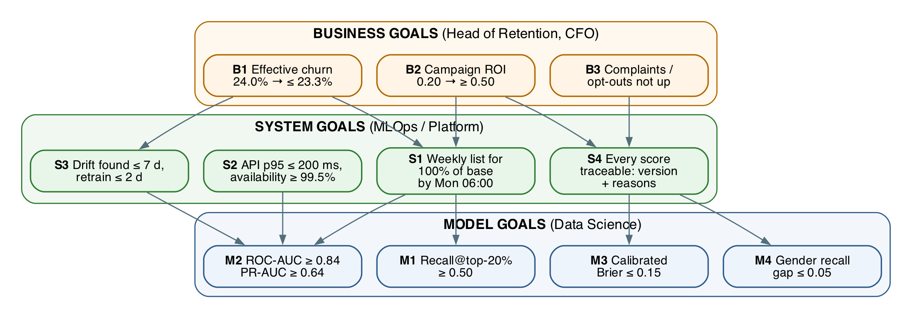
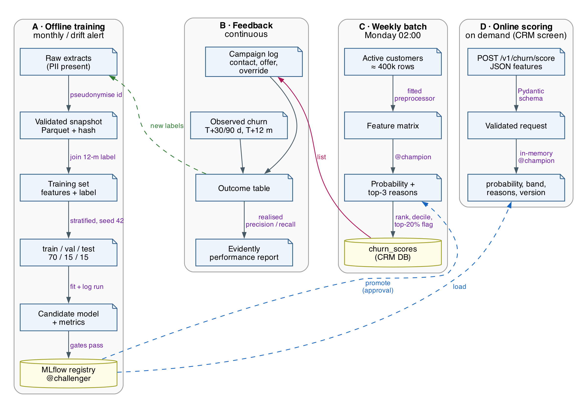
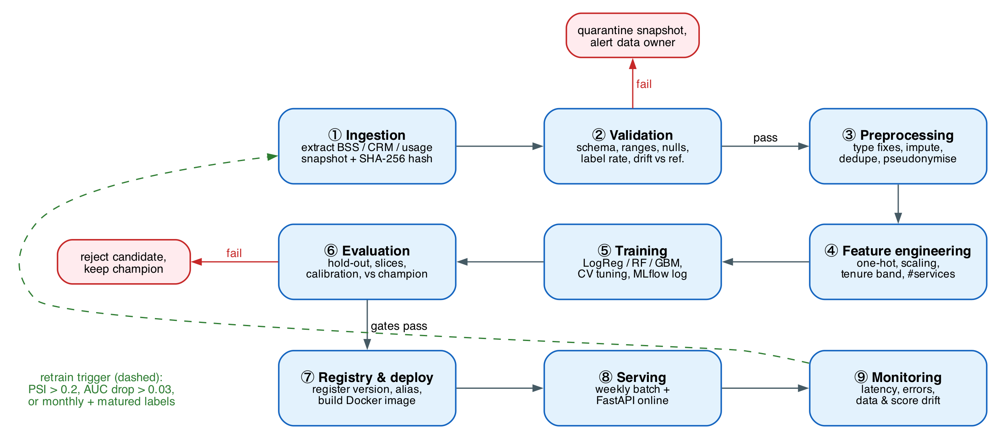
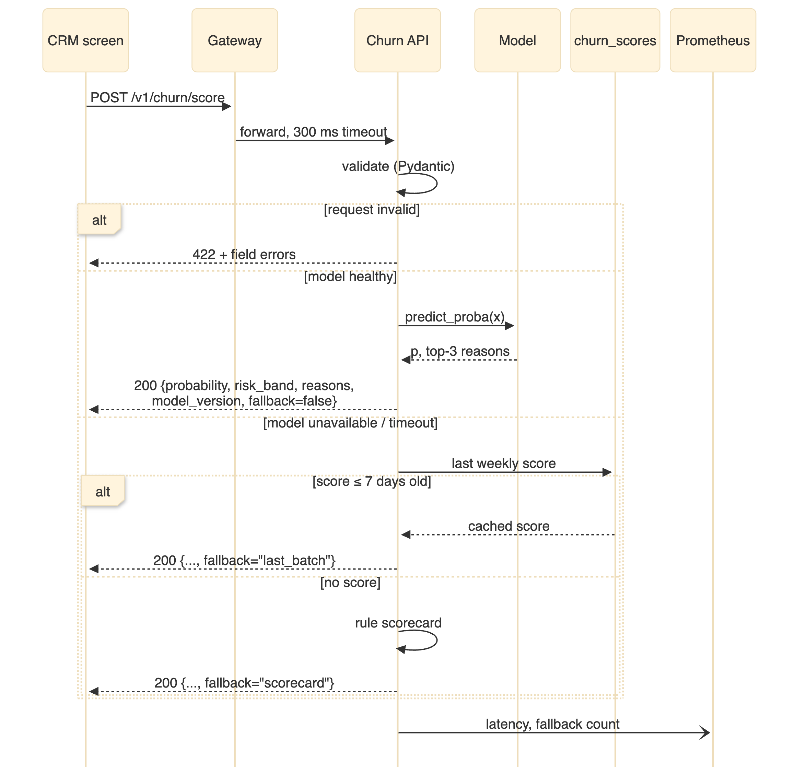

```{=html}
<section class="cover">
  <div class="cover-top">
    <p class="cover-course">DDM501 — AI in DevOps, DataOps, MLOps</p>
    <p class="cover-kind">Individual Assignment 1 · ML System Design Document</p>
  </div>
  <h1 class="cover-title">ChurnGuard</h1>
  <p class="cover-sub">Design of a production ML system that predicts<br/>postpaid customer churn for retention targeting</p>
  <table class="cover-meta">
    <tr><td>Student</td><td>Phạm Ngọc Hòa</td></tr>
    <tr><td>Student ID</td><td>hoa25ms13299</td></tr>
    <tr><td>Course</td><td>DDM501 — AI in DevOps, DataOps, MLOps</td></tr>
    <tr><td>Assignment</td><td>Individual Assignment 1 (5%)</td></tr>
    <tr><td>Dataset</td><td>IBM Telco Customer Churn (7,043 customers)</td></tr>
    <tr><td>Date</td><td>October 2026</td></tr>
  </table>
  <p class="cover-note">Numbers marked <b>[A]</b> are business assumptions of a hypothetical operator; numbers marked <b>[M]</b> are measured on the IBM dataset by <code>report/scripts/data_profile.py</code> (output: <code>report/data/profile.json</code>).</p>
</section>
```

# Executive Summary {.unnumbered .unlisted}

**NovaTel** (a hypothetical Vietnamese operator with 400,000 postpaid mobile and home-internet subscribers [A]) loses about one in four postpaid customers per year when no retention action is taken. The IBM Telco sample used for prototyping has the same profile: 26.5% churners among 7,043 customers [M]. Today the Retention team builds its call list from one rule ("month-to-month contract and tenure ≤ 12 months"). That rule flags 28.3% of the base, more than the 20% the call centre can contact, and only 51.4% of the flagged customers actually churn [M]. With the assumed offer economics (USD 50 per contact, 25% of contacted churners saved, USD 466 margin per saved customer [A]), the current campaign returns an ROI of only 0.20.

This document designs **ChurnGuard**, a single binary-classification model wrapped in a production system. Every week it scores 100% of active customers, ranks them by churn probability, and hands the top 20% (with reason codes) to Retention. It also exposes a low-latency API for the CRM agent screen. The design targets **Recall@top-20% ≥ 0.50** (a measured feasibility check suggests this is reachable; a strong hand-made scorecard reaches 0.476 [M]). At that recall the system saves about 3,000 more customers per year than today, cuts effective churn from 24.0% to ≤ 23.3%, and lifts campaign ROI from 0.20 to ≥ 0.50, worth about USD 1.4 M per year of additional net margin [A].

The architecture uses boring, proven open-source parts that Assignment 2 will implement end to end: Airflow for orchestration, Pandera for data validation, a scikit-learn pipeline, MLflow for experiment tracking and the model registry, FastAPI in Docker for serving, Prometheus/Grafana for operational monitoring, and Evidently for drift monitoring. Graceful degradation (live model → last weekly score → rule scorecard), human approval before a model is promoted, and pseudonymised, gender-free features are deliberate trade-offs, analysed in Section 5.

```{=html}
<div id="toc-placeholder"></div>
```

# Problem Definition

## Context and Background

Telecom markets in Vietnam are saturated: almost every adult already holds a SIM card, and number portability (in place since 2018) lets a customer switch operators while keeping the same number. Growth therefore comes mainly from *keeping* profitable customers rather than from acquiring new ones. Retaining a customer usually costs far less than acquiring a replacement, which is why churn prediction is a standard ML use case in telecom [9].

**Organisation (hypothetical).** NovaTel sells postpaid bundles (mobile, fibre/DSL internet, add-ons such as streaming and tech support). The key figures used throughout this document are listed below.

| Item | Value | Source |
|---|---|---|
| Active postpaid subscribers | 400,000 | [A] |
| Average monthly charge (ARPU) | USD 64.76 | [M] IBM sample mean |
| Annual churn without retention action | 26.5% → 106,160 customers/year | [M] sample churn rate, applied to the base [A] |
| Gross margin on service revenue | 60% → USD 466.27 per retained customer-year | [A] 64.76 × 12 × 0.6 |
| Retention offer cost (discount + agent time) | USD 50 per contacted customer | [A] |
| Save rate (contacted churners who stay ≥ 12 months) | 25% | [A] |
| Contact capacity of the retention call centre | 20% of base = 80,000 contacts/year | [A] |

**Why it matters.** At the figures above, churn wipes out about USD 49.5 M of gross margin each year (106,160 × 466.27). The retention budget (USD 4.0 M per year) is spent on a list in which about half of the contacted customers would never have left. Figure 1 shows that churn is concentrated in identifiable segments. That makes targeting possible, but the segments overlap heavily, so simple rules either flag too many customers or miss many churners.

![Churn rate by segment in the IBM Telco sample (dashed line = overall 26.5%) [M].](figures/fig_churn_segments.png){width=82%}

## Problem Statement

> **Problem.** The Retention team cannot reliably tell which 20% of postpaid customers are most likely to churn in the next 12 months. Its current list reaches only 38.7% of future churners at full call-centre capacity, so most of the USD 4.0 M yearly campaign budget is spent on customers who would have stayed.

Stated as a SMART objective:

- **Specific:** rank every active postpaid customer weekly by 12-month churn probability and deliver the top 20% (with reasons) to the campaign tool and CRM.
- **Measurable:** raise *Recall@top-20%* from 0.387 (status quo [M-derived]) to ≥ 0.50, which reduces effective annual churn from 24.0% to ≤ 23.3% (≈ 3,000 more customers retained) and raises campaign ROI from 0.20 to ≥ 0.50.
- **Achievable:** a feasibility check (5-fold cross-validated, untuned logistic regression on the IBM sample, `feasibility_check.py`) reached Recall@top-20% 0.508, ROC-AUC 0.845 and PR-AUC 0.654 [M]; Assignment 2 will confirm this on a held-out test set.
- **Relevant:** directly drives the two KPIs owned by the Head of Retention and the CFO (churn rate, campaign ROI).
- **Time-bound:** shadow mode within 3 months, full rollout within 6 months, KPI target evaluated 12 months after rollout against a randomised control group.

## Current Situation

| Aspect | How it works today | Weakness |
|---|---|---|
| Targeting rule | Monthly spreadsheet filter: *Contract = Month-to-month AND tenure ≤ 12* | Flags 28.3% of base (> 20% capacity); precision 0.514, recall 0.548, F1 0.530 [M] |
| List selection | Agents pick customers from the flagged list in no particular order | Effective Recall@capacity = 0.514 × 80,000 / 106,160 = **0.387** |
| Reactive saves | CSKH (customer care) offers discounts only when a customer calls to cancel | Too late: many port-outs are already in progress |
| Refresh cadence | Monthly, manual Excel export from BSS | Stale; error-prone; no audit trail |
| Measurement | Campaign "success" = customer still active next month, no control group | Cannot separate campaign effect from customers who would have stayed anyway |
| Knowledge | Rules live in one analyst's head and spreadsheet | Bus factor of 1; rules never revalidated |

An improved non-ML scorecard (2 points for month-to-month, 1 each for tenure ≤ 12, electronic check, fibre and no tech support) would do better: ROC-AUC 0.826, Recall@top-20% 0.476 [M]. Because its weights were chosen by looking at this same data, these numbers are an *optimistic* upper bound for a rule-based approach. We keep this scorecard as the **baseline to beat** and as the **fallback** in production.

## Justification: Why ML Is the Appropriate Approach

Following Hulten's checklist [2] and Kästner's "when to use ML" guidance [3], ML fits this problem because:

1. **The pattern is real but too complex to hand-code.** Churn depends on interactions among about 19 attributes (contract × tenure × service mix × charges × payment). Rules capture the main effects; a learned model can also weight the interactions and produce a *continuous* ranking, which a 20%-capacity list needs.
2. **Probabilities enable expected-value decisions.** Calibrated probabilities let Retention contact a customer only when *P(churn) × save rate × margin > offer cost*. That break-even is P ≥ 0.43 [A]; a binary rule cannot support it.
3. **The problem drifts.** Prices, competitor offers and the product mix change. A retrained model adapts on a schedule, while a spreadsheet rule decays silently.
4. **Labels arrive for free.** Every churn or port-out event in BSS is a label. Supervised learning has a renewable training signal.
5. **Errors are cheap and recoverable.** A wrong prediction costs one unnecessary discount (false positive) or one missed save opportunity (false negative). Nobody is denied a service, and a human stays in the loop.

**When ML is *not* needed.** If NovaTel could not sustain the MLOps platform (about USD 120 k per year in infrastructure and part-time staff [A]), the scorecard alone would capture about 80% of the benefit: +USD 1.10 M per year versus +USD 1.40 M per year for the ML target [A]. The ML system is therefore justified only if it beats the scorecard in a controlled test. This condition is built into the evaluation gates (Section 4.3) and into the fallback design.

## Stakeholder Identification

| Stakeholder | Goals | Concerns | Potential conflicts |
|---|---|---|---|
| **Head of Retention / Marketing** (primary user, business owner) | Lower churn; more saves per campaign USD | List quality, explainable reasons for the script, weekly freshness | Wants large lists and generous offers ↔ CFO cost limits |
| **CFO / Finance** | Positive campaign ROI; predictable spend | Discounts given to customers who would have stayed (FP cost) | Prefers small, high-precision lists ↔ Retention's recall goal |
| **Customer care agents (CSKH)** | Fast, clear guidance during calls | Latency on the CRM screen; reasons they can explain to customers | Does not want extra call volume ↔ campaign size |
| **Data Science team** | High-quality, maintainable models | Label quality, leakage, drift, time to experiment | Wants complex models ↔ MLOps simplicity and latency |
| **MLOps / Platform team** | Reliable, observable, cheap system | On-call load, reproducibility, rollback | Prefers fewer components ↔ data-science tooling wishes |
| **Customers** (data subjects) | Fair offers, no harassment, privacy | Profiling without consent; spam calls | Personalisation ↔ privacy and opt-out rights |
| **Legal / DPO** | Compliance with PDPL 2025 / Decree 356, GDPR for EU roaming customers | Lawful basis, DPIA, retention periods, sensitive attributes | Restricts features ↔ model accuracy |

Two conflicts drive the design. **Recall vs. precision** (Retention vs. CFO) is resolved by optimising Recall@top-20% under a fixed capacity, with precision required to stay above the 0.43 break-even. **Accuracy vs. privacy** (Data Science vs. Legal) is resolved by excluding PII and gender from the features (Section 5.5).

# Requirements Analysis

## Functional Requirements

| ID | Requirement | Priority |
|---|---|---|
| FR‑1 | **Core prediction:** for each active postpaid customer, output the probability of churn within the next 12 months, a risk band (*High* = top 20%, *Medium* = next 20%, *Low* = rest) and a decile. | Must |
| FR‑2 | **Explanations:** return the top-3 reason codes per prediction (e.g., `CONTRACT_MONTH_TO_MONTH`, `TENURE_LT_12M`, `NO_TECH_SUPPORT`) derived from model attributions. | Must |
| FR‑3 | **Weekly batch scoring:** score 100% of active customers every Monday and write results to `churn_scores` (one row per customer per `score_date`). Re-running for the same date overwrites that partition (idempotent). | Must |
| FR‑4 | **Online scoring API:** `POST /v1/churn/score` for 1–1,000 customers; `GET /health` and `GET /metrics` for operations. | Must |
| FR‑5 | **Integration — input:** read nightly extracts from BSS (contract, billing, payment), CRM (profile, tickets, campaign history) and the service inventory, using read-only service accounts. | Must |
| FR‑6 | **Integration — output:** expose `churn_scores` as a read-only view to the campaign tool and BI; the CRM agent screen calls the API with a service token. | Must |
| FR‑7 | **User interaction — campaign manager:** filter the list by band/segment, exclude do-not-contact and recently contacted customers, **override** (add/remove) customers with a mandatory reason, and approve the list before export. | Must |
| FR‑8 | **User interaction — agent screen:** show a risk badge, probability and three plain-language reasons; let the agent record the outcome (accepted offer, declined, unreachable). | Should |
| FR‑9 | **Feedback capture:** store every contact, offer, override and outcome, and join actual churn events at T+30/90 days (early) and T+12 months (final label). | Must |
| FR‑10 | **Model lifecycle:** retrain monthly and on drift alerts; register every candidate in MLflow; promotion to `@champion` requires human approval; rollback to the previous version in ≤ 15 minutes. | Must |
| FR‑11 | **Audit:** every score stores `model_version`, `data_snapshot_hash`, `feature_schema_version` and a timestamp. | Must |
| FR‑12 | **Opt-out:** customers who object to profiling or marketing are excluded from scoring outputs and campaign lists (PDPL Art. 4 & 28; GDPR Art. 21). | Must |
| FR‑13 | **Control group:** randomly hold out 10% of the High band from contact each cycle so that the uplift can be measured. | Should |

**Input/output specification (online API, v1).** The batch job uses the same schema (as a Parquet file). Field names follow the IBM dataset so that Assignment 2 can implement the schema directly.

```json
POST /v1/churn/score
{
  "request_id": "b6f0c1e2-6a4d-4c1e-9d55-2f0f6a1d9e10",
  "customers": [{
    "customer_id": "c3a9…e1",
    "tenure": 5, "Contract": "Month-to-month", "PaperlessBilling": "Yes",
    "PaymentMethod": "Electronic check", "MonthlyCharges": 89.10, "TotalCharges": 445.50,
    "PhoneService": "Yes", "MultipleLines": "No", "InternetService": "Fiber optic",
    "OnlineSecurity": "No", "OnlineBackup": "No", "DeviceProtection": "No",
    "TechSupport": "No", "StreamingTV": "Yes", "StreamingMovies": "No",
    "SeniorCitizen": 0, "Partner": "No", "Dependents": "No"
  }]
}
```

```json
200 OK
{
  "request_id": "b6f0c1e2-6a4d-4c1e-9d55-2f0f6a1d9e10",
  "model_version": "churnguard-classifier/7", "fallback": false,
  "predictions": [{
    "customer_id": "c3a9…e1", "churn_probability": 0.71, "risk_band": "High", "decile": 1,
    "reasons": ["CONTRACT_MONTH_TO_MONTH", "TENURE_LT_12M", "NO_TECH_SUPPORT"]
  }]
}
```

`customer_id` is always the pseudonymised SHA-256 key, never the raw subscriber ID. `gender` is not part of the request because it is not a model feature. Validation rules: categorical fields must belong to their known domains, `0 ≤ tenure ≤ 120`, `0 < MonthlyCharges ≤ 500`, and `TotalCharges ≥ 0`. A violation returns HTTP 422 with field-level errors. Unknown extra fields are ignored and logged.

## Non-Functional Requirements

| ID | Category | Requirement (target) | How verified |
|---|---|---|---|
| NFR‑1 | Performance — latency | Online API p95 ≤ 200 ms, p99 ≤ 500 ms end to end for 1 customer; model inference alone ≤ 50 ms | Locust load test in CI; Prometheus histogram |
| NFR‑2 | Performance — throughput | Sustain 50 requests/s (≈ 1,200 agents [A] × 1 lookup/min at peak = 20 RPS, × 2.5 headroom) | Load test |
| NFR‑3 | Performance — batch | Score 400,000 customers in ≤ 60 min on 4 vCPU; results ready by Monday 06:00 | Airflow SLA miss alert |
| NFR‑4 | Scalability | Support 1 M customers and 150 RPS without redesign: stateless API replicas behind a load balancer (scale out at 70% CPU), batch scoring in chunks of 50k rows | Capacity test at 2.5× load |
| NFR‑5 | Reliability — availability | API ≥ 99.5% monthly (≤ 3.6 h downtime); batch on time ≥ 99% of weeks | Uptime probe; SLA report |
| NFR‑6 | Reliability — graceful degradation | If the model or API fails: (1) serve the last weekly score if ≤ 7 days old, else (2) the rule scorecard, always flagged `fallback`. The CRM screen must never block on ChurnGuard (300 ms client timeout). | Chaos test: kill model container |
| NFR‑7 | Reliability — failure handling | Ingestion/training tasks retry 3× with exponential backoff; failed validation quarantines the snapshot and keeps the previous model; batch writes are idempotent per `score_date` | Fault-injection tests |
| NFR‑8 | Maintainability — retraining | Scheduled monthly; triggered early when PSI > 0.2 on any top-10 feature or rolling ROC-AUC drops > 0.03 | Airflow DAG run history |
| NFR‑9 | Maintainability — monitoring | Operational metrics (latency, errors, RPS, fallback rate) in Prometheus/Grafana; weekly Evidently data/score drift report; alerts to on-call via Alertmanager | Dashboards; alert test |
| NFR‑10 | Maintainability — code & config | Config in YAML + environment variables; ≥ 80% unit-test coverage for data and feature code; every run reproducible from Git SHA + data hash + seed | CI pipeline |
| NFR‑11 | Security | TLS everywhere; API service tokens; role-based access (DS read pseudonymised data only); secrets in a vault, never in Git | Security review |
| NFR‑12 | Compliance | DPIA filed before go-live; data retention ≤ 24 months for features/scores; opt-outs honoured within 72 h | DPO sign-off |

## Data Requirements

**Data sources.**

| Source | Content (examples) | Refresh | Owner | In IBM prototype? |
|---|---|---|---|---|
| BSS / Billing | tenure, contract type, monthly & total charges, payment method, paperless billing | Daily extract | Billing IT | Yes |
| Service inventory | phone, multiple lines, internet type, security, backup, device protection, tech support, streaming | Daily | Network IT | Yes |
| CRM profile | senior citizen flag, partner, dependents, (gender — audit only) | Daily | CRM team | Yes |
| CRM interactions | tickets, complaints, last contact, campaign outcomes, opt-out flag | Daily | CRM team | No (production only) |
| Usage aggregates | data volume trend, dropped-call rate, top-up/roaming | Daily aggregate | Network analytics | No (future feature) |
| Labels | termination / port-out events with dates | Daily | BSS | Yes (`Churn`) |

**Label definition.** `churn = 1` if the account is terminated or ported out within 12 months after the snapshot date. Early proxies at T+30 and T+90 days feed monitoring before the final labels mature. Features are computed only from data available *at* the snapshot date, to avoid label leakage. The IBM sample's `Churn` column only means "left within the last month" [10], so it is a short-term proxy for this 12-month production label. Using its 26.5% as NovaTel's annual churn rate is assumption [A] (Section 6, row 1).

**Data quality.** The validation stage enforces the checks below. The "Observed" column comes from profiling the IBM sample [M].

| Check | Rule | Observed in IBM sample | Action on failure |
|---|---|---|---|
| Schema & types | 21 expected columns; numeric types for `tenure`, `MonthlyCharges`, `TotalCharges` | `TotalCharges` stored as text; 11 blank values | Cast; blanks → see next row |
| Missing values | `TotalCharges` blank only when `tenure = 0` (new customer) | 11 blanks, all with `tenure = 0`; no other nulls | Impute 0; any other null → fail |
| Uniqueness | `customer_id` unique per snapshot | 0 duplicates | Fail run |
| Ranges | `0 ≤ tenure ≤ 120`; `0 < MonthlyCharges ≤ 500` | tenure 0–72; charges 18.25–118.75 | Fail run |
| Domain / consistency | Categorical values in known set; "No internet service" ⇔ `InternetService = No` | Consistent | Fail run |
| Cross-field | `TotalCharges ≈ tenure × MonthlyCharges` (± 30%) | Plausible | Warn (data-owner ticket) |
| Label rate | Churn rate within 15–40% | 26.5% | Fail run (stops before training) |
| Freshness | Snapshot ≤ 24 h old at batch start | n/a | Retry, then use last snapshot |
| Drift | PSI vs. reference ≤ 0.2 per feature | n/a | Alert + trigger retrain evaluation |

**Privacy.** Since 1 January 2026, personal data in Vietnam is governed by the **Law on Personal Data Protection No. 91/2025/QH15** and its implementing **Decree 356/2025/ND-CP**, which replaced Decree 13/2023/ND-CP. Under the transitional provision, consents collected under Decree 13 remain valid [6][7]. EU customers (roaming or expatriate subscribers) are also covered by the GDPR [8]. The design applies:

- **Data minimisation:** direct identifiers (name, phone number, national ID, address) never leave BSS/CRM. `customer_id` is pseudonymised with salted SHA-256; the salt lives in the secrets vault, and only the CRM integration can re-identify a customer.
- **Purpose limitation and AI risk classification** (PDPL Art. 30): data is used only for retention offers. The system is classed as *limited risk* because a human decides on each contact, no service is denied, and no legal effect is produced.
- **Sensitive and protected attributes:** `gender` is *excluded from features* and used only for offline fairness audits. `SeniorCitizen` (age-derived) is kept as a feature but monitored for disparate impact.
- **Data subject rights:** opt-out of profiling and marketing (PDPL Art. 4, 10, 28; GDPR Art. 21) is propagated to scoring outputs within 72 h. Access and deletion requests are served by the CRM.
- **Accountability:** a processing-impact assessment dossier (PDPL Art. 21) is filed before go-live; breach notification within 72 h (PDPL Art. 23); retention of 90 days for raw extracts and 24 months for features, scores and logs.
- **Residency:** all components are self-hosted in NovaTel's Vietnamese data centre, so there is no cross-border transfer and no SaaS tracking tools.

**Data volume (estimates).**

| Dataset | Rows | Size | Growth |
|---|---|---|---|
| IBM prototype sample | 7,043 × 21 columns | 0.95 MB CSV | static |
| Customer snapshot (features) | 400 k per snapshot | ≈ 150 MB Parquet | monthly snapshot → ≈ 1.8 GB/yr |
| Daily usage aggregates | 400 k/day ≈ 146 M/yr | ≈ 8 GB/yr Parquet | +10%/yr with base growth |
| Weekly scores | 20.8 M/yr | ≈ 1.5 GB/yr | linear |
| API request logs | ≈ 150 k/day | ≈ 10 GB/yr | linear |

All of this fits on a single PostgreSQL instance plus object storage, so no distributed engine (Spark, Kafka) is needed at this scale (see Section 5.2).

## Requirements Traceability

Each requirement is traced to the goal it serves (Section 3), the component that implements it (Section 4) and the check that verifies it. A requirement without a verification method is not considered done.

| Requirements | Goal served | Implemented by | Verified by |
|---|---|---|---|
| FR‑1, FR‑3 (weekly risk list) | S1, M1, M2 | Batch scoring job + `@champion` model | Airflow SLA, row-count check, test-set metrics |
| FR‑2 (reason codes) | S4, B3 | Evaluation stage (attributions), API response | Unit tests on reason mapping; agent feedback |
| FR‑4, NFR‑1, NFR‑2 (online API) | S2 | FastAPI service, in-memory model | Load test; Prometheus p95 / RPS |
| FR‑5, FR‑6 (integration) | S1 | Ingestion tasks, `churn_scores` view, API token | Contract tests with BSS/CRM extracts |
| FR‑7, FR‑8 (user interaction, override) | B2, B3 | Campaign tool and CRM screen reading scores | User acceptance test with Retention and CSKH |
| FR‑9, FR‑13 (feedback, control group) | B1, B2 | Outcome & label store, random hold-out | Monthly uplift report vs. control |
| FR‑10, NFR‑8, NFR‑9 (lifecycle, monitoring) | S3 | Airflow DAG, MLflow registry, Evidently, Prometheus | Drift-alert drill; DAG run history |
| FR‑11, NFR‑10 (audit, reproducibility) | S4 | MLflow tags (Git SHA, data hash, seed), score columns | Audit query; CI re-run within ± 0.002 |
| FR‑12, NFR‑11, NFR‑12 (privacy, security) | B3, compliance | Pseudonymisation at ingestion, opt-out filter, vault | DPO review; opt-out unit test |
| NFR‑4 – NFR‑7 (scale, availability, fallback) | S2 | Stateless replicas, chunked batch, fallback chain, retries | Capacity and chaos tests |

# Goals and Metrics

## Goal Hierarchy

Following the goal model from Session 2 and Kästner [3], goals cascade from business outcomes through system behaviour to model quality (Figure 2). Every model goal is something Assignment 2 can measure offline; every business goal is measured online against a control group.

{width=96%}

## Business Goals

| Goal / metric | Definition | Baseline | Target (12 months) | Minimum acceptable | How measured |
|---|---|---|---|---|---|
| **B1** Effective annual churn | Customers lost ÷ average base, after retention actions | 24.0% (status quo, derived) | ≤ 23.3% | ≤ 23.7% | BSS monthly; uplift vs. 10% control group |
| **B2** Campaign ROI | (retained margin − campaign cost) ÷ campaign cost | 0.20 | ≥ 0.50 | ≥ 0.35 | Finance, quarterly |
| Customers saved vs. status quo | Extra customers retained per year | 0 | ≥ 3,000 | ≥ 1,500 | Control-group uplift |
| **B3** Complaint rate | Complaints per 1,000 contacts | current level | not higher | +10% max | CRM tickets |
| Agent adoption | % of retention calls where the risk badge was viewed | n/a | ≥ 80% | ≥ 60% | API logs |

## System Goals

| Goal / metric | Target | Minimum acceptable | How measured |
|---|---|---|---|
| **S1** Batch completeness & timeliness | 100% of active base scored by Mon 06:00 | ≥ 99.5% of base; ≥ 99% of weeks on time | Airflow SLA, row counts |
| **S2** API latency / availability | p95 ≤ 200 ms; ≥ 99.5% | p95 ≤ 300 ms; ≥ 99.0% | Prometheus |
| Error / fallback rate | 5xx < 0.5%; fallback < 1% of requests | < 2% / < 5% | Prometheus counters |
| **S3** Drift detection / recovery | Detected ≤ 7 days; retrain + redeploy ≤ 2 days | ≤ 14 days / ≤ 5 days | Evidently + Airflow logs |
| **S4** Traceability & reproducibility | 100% of scores carry model version; retraining from (Git SHA, data hash, seed) reproduces metrics within ± 0.002 | 100% / ± 0.005 | Audit query; CI re-run |

## Model Goals

All model metrics are computed on a stratified, held-out test set (15%, never used for tuning), with the positive class = churn. Baselines are measured on the IBM sample [M].

| Metric | Role | Definition | Baseline (scorecard) | Target | Minimum acceptable (gate) |
|---|---|---|---|---|---|
| **Recall@top-20%** | **Primary** | Share of all churners found in the 20% of customers with the highest scores | 0.476 (random 0.210; status quo 0.387) | ≥ 0.50 | ≥ 0.48 (must beat scorecard) |
| Precision@top-20% | Secondary | Share of churners within the top 20% | 0.631 | ≥ 0.66 | ≥ 0.60 (≫ 0.43 break-even) |
| ROC-AUC | Secondary | Ranking quality over all thresholds | 0.826 | ≥ 0.84 | ≥ 0.83 |
| PR-AUC (average precision) | Secondary | Ranking quality focused on the positive class (imbalanced data) | 0.571 | ≥ 0.64 | ≥ 0.60 |
| F1 at operating threshold | Secondary | Harmonic mean of precision and recall at the threshold tuned on validation | 0.530 (binary rule) | ≥ 0.62 | ≥ 0.58 |
| Brier score | Calibration | Mean squared error of probabilities (lower is better) | n/a (not probabilistic) | ≤ 0.15 | ≤ 0.17 |
| Gender recall gap | Fairness guardrail | \|recall(female) − recall(male)\| at the operating threshold | n/a | ≤ 0.05 | ≤ 0.05 (gate) |
| Senior-citizen recall gap | Fairness monitor | Same, for SeniorCitizen = 1 vs. 0 (base rates differ: 41.7% vs. 23.6% [M]) | n/a | report | review if > 0.15 |
| Inference latency | Operational | p95 time for one `predict_proba` call | n/a | ≤ 20 ms | ≤ 50 ms |

Accuracy is deliberately *not* used: a model that predicts "no churn" for everyone scores 73.5% accuracy and is useless.

## Linking Model Metrics to Business KPIs

**Cost of errors.** With the [A] economics, contacting a true churner yields an expected 0.25 × 466.27 − 50 = **+USD 66.6**, and contacting a non-churner costs **−USD 50** (false positive). Missing a churner (false negative) forgoes the USD 66.6 opportunity *and* uses up a capacity slot on someone else. The campaign therefore breaks even when list precision is ≥ 50 / (0.25 × 466.27) = **0.43**. Random targeting (0.28) loses money; every ML candidate must clear 0.43 with a wide margin.

**Why Recall@top-20% is primary.** Capacity is fixed at 20% of the base, so the business value grows linearly with the number of churners captured *inside that 20%*. Each +0.01 of Recall@top-20% means +265 saved customers and +USD 124 k of margin per year (0.01 × 106,160 × 0.25 × 466.27). ROC-AUC and PR-AUC are secondary because they also reward ranking quality outside the contacted segment.

| Targeting policy (80,000 contacts/yr) | Recall@cap. | Precision@cap. | Saved/yr | Net margin/yr | ROI | Effective churn |
|---|---|---|---|---|---|---|
| Random | 0.210 [M] | 0.278 | 5,565 | −1.40 M | −0.35 | 25.2% |
| Status quo (binary rule) | 0.387 [M-derived] | 0.514 | 10,270 | +0.79 M | 0.20 | 24.0% |
| Improved scorecard (fallback) | 0.476 [M] | 0.631 | 12,625 | +1.89 M | 0.47 | 23.4% |
| **ChurnGuard (target)** | **0.500** | **0.664** | **13,270** | **+2.19 M** | **0.55** | **23.2%** |

All monetary values are USD and computed by `business_case()` in `data_profile.py` from the [A] assumptions. Compared with the scorecard, ML adds ≈ USD 0.30 M per year, against ≈ USD 0.12 M per year of platform cost [A]. The margin is positive but modest, which is why Section 4 keeps the system lean and Section 5.3 keeps the scorecard as a first-class fallback.

**From offline to online.** Offline Recall@top-20% is a proxy. The online truth is the *realised uplift*: churn rate in the contacted High band versus the 10% control group (FR-13). If the realised precision of the contacted list falls below 0.55 for two consecutive months, the model is re-evaluated even without a drift alarm.

# High-Level Architecture Design

## Architecture Overview

ChurnGuard follows a classic batch-first ML architecture [1][3] with six layers (Figure 3). Existing source systems feed a small data platform. An Airflow-orchestrated ML platform trains and registers models. The serving layer has two paths, a weekly batch job and an online API, both loading the same `@champion` model from the MLflow registry. Consumers (campaign tool, BI, CRM screen) never call the model directly; they read scores or call the API. The monitoring and feedback layer closes the loop.

{width=100%}

Key architectural decisions:

- **Batch-first, online as a complement.** About 95% of decisions (campaign lists) need weekly freshness; the API exists for agent context and for "what-if" checks after a plan change.
- **One model artefact, two serving paths.** The scikit-learn `Pipeline` (preprocessing + classifier) is logged as a single MLflow model, so training and serving apply *identical* transformations. This eliminates training/serving skew.
- **Registry aliases decouple deployment from training.** Serving loads `models:/churnguard-classifier@champion`; promotion or rollback is an alias switch, not a redeploy.
- **Everything containerised.** Airflow, MLflow, the API, Prometheus and Grafana run as Docker containers (docker-compose in development, Kubernetes in production).

## Data Flow

Figure 4 traces data through the four paths. **(A) Offline training:** raw extracts are pseudonymised, validated, snapshotted as Parquet with a content hash, joined with labels and split 70/15/15 (stratified, seed 42); candidates are logged to MLflow and registered as `@challenger` if they pass the gates. **(B) Feedback:** campaign contacts, overrides and observed churn feed an outcome table that supplies new labels and realised-performance reports. **(C) Weekly batch:** active customers go through the *same fitted preprocessor* and the champion model, then are ranked; the top 20% are flagged and written to `churn_scores`. **(D) Online:** a JSON request is validated by Pydantic and scored in memory.

{width=80%}

## ML Pipeline Stages

The pipeline (Figure 5) has nine stages. Each stage is a separate Python module and Airflow task with explicit inputs and outputs and its own quality gate, so a failure stops the run at the earliest point and never reaches production.

{width=80%}

| Stage | Key operations | Output | Quality gate |
|---|---|---|---|
| ① Ingestion | Extract BSS/CRM/inventory tables; pseudonymise ID; write raw Parquet; compute SHA-256 | `raw/<date>.parquet`, hash | Row count within ± 5% of last run |
| ② Validation | Pandera schema, ranges, domains, null rules, label rate, PSI vs. reference | Validated snapshot + report | All *fail* rules pass, else quarantine |
| ③ Preprocessing | Cast `TotalCharges`, impute new-customer blanks, deduplicate, drop `gender` and IDs | Clean table | No nulls remain; schema version recorded |
| ④ Feature engineering | One-hot encode 15 categoricals, scale 3 numerics, `tenure_band`, `num_services`, `charges_per_tenure` | Fitted `ColumnTransformer` | Feature count matches schema |
| ⑤ Training | Logistic regression (baseline), random forest, gradient boosting; stratified 5-fold CV tuning; class weighting; log everything to MLflow | Candidate model + run | Run completes; CV variance < 0.02 AUC |
| ⑥ Evaluation | Test-set metrics, slice metrics (contract, senior, gender), calibration curve, comparison with scorecard and champion | Metrics JSON, plots | Model-goal minimums (Section 3.4), not worse than champion by > 0.01 Recall@top-20% |
| ⑦ Registry & deploy | Register version, set `@challenger`; after human approval set `@champion`; build/tag Docker image | Model version, image tag | Approval recorded; smoke test on 100 rows |
| ⑧ Serving | Weekly batch scoring; FastAPI online endpoint with fallback chain | `churn_scores`, API responses | Completeness ≥ 99.5%; p95 latency |
| ⑨ Monitoring | Prometheus metrics, Evidently data/score drift, realised performance from feedback | Dashboards, alerts, retrain trigger | PSI ≤ 0.2; AUC drop ≤ 0.03 |

## Online Inference and Graceful Degradation

Figure 6 shows the online request path. The API never makes the CRM screen wait: if the model is unavailable or exceeds its time budget, it returns the last batch score; if no recent score exists, it returns the rule scorecard. The response always carries a `fallback` flag, so agents and dashboards know which source they are seeing, and Prometheus counts every fallback.

{width=100%}

## Component Description

| Component | Purpose & responsibility | Technologies considered | Choice & rationale |
|---|---|---|---|
| Ingestion | Pull daily extracts from BSS/CRM; pseudonymise; snapshot | Airbyte, Kafka CDC, custom Python + SQL | **Python tasks in Airflow** — daily batch is enough; CDC/Kafka adds a cluster to operate for no business gain |
| Data validation | Enforce schema and quality rules; quarantine bad data | Great Expectations, Pandera, TFDV | **Pandera** — schemas as Python code, unit-testable, light; GE reconsidered if many teams share rules |
| Storage & data versioning | Immutable raw/validated/feature snapshots | DVC, Delta Lake, Parquet + hash | **Parquet + SHA-256 hash logged to MLflow** (DVC optional) — simplest way to tie a model to its exact data |
| Feature table | Serve the latest features to batch and API | Feast, Redis, PostgreSQL | **PostgreSQL** — features change daily, QPS is low; a feature store is premature |
| Training | Fit and tune candidate models | scikit-learn, XGBoost/LightGBM, PyTorch | **scikit-learn Pipeline** (LogReg, RF, HistGradientBoosting) — tabular data, small, one artefact for preprocessing + model |
| Experiment tracking & registry | Log params/metrics/artefacts; version models; aliases | MLflow, Weights & Biases, Neptune | **MLflow** — open source, self-hosted (data residency), registry aliases for champion/challenger |
| Orchestration | Schedule and retry the DAGs; SLAs; backfills | Airflow, Prefect, Kubeflow, cron | **Apache Airflow** — mature retries/SLA/alerting; team skill (course labs); Kubeflow needs Kubernetes expertise |
| Online serving | Low-latency scoring, validation, fallback | FastAPI, BentoML, MLflow `serve`, TorchServe | **FastAPI + Uvicorn** — Pydantic validation, OpenAPI docs for the CRM team, full control of the fallback logic |
| Batch scoring | Score 400 k customers weekly | pandas (chunked), Spark | **pandas in chunks** — 400 k rows fit in memory; Spark only beyond ~10 M rows |
| Packaging & deployment | Reproducible runtime | Docker, Conda, VM images | **Docker** (+ docker-compose in dev, Kubernetes in prod) — same image from CI to production |
| Operational monitoring | Latency, errors, throughput, alerts | Prometheus + Grafana + Alertmanager, Datadog, CloudWatch | **Prometheus stack** — open source, standard `/metrics` endpoint, no data leaves the data centre |
| ML monitoring | Data drift, score drift, realised performance | Evidently, NannyML, WhyLabs | **Evidently** — open source, drift + classification reports as HTML/JSON artefacts |
| CI/CD | Lint, test, build, push images | GitHub Actions, GitLab CI, Jenkins | **GitHub Actions** — already used for the course repository |

## Deployment and Operations View

The same Docker images move through three environments. Code and models are released independently: code by image tag (Git SHA), models by registry alias. Either can be rolled back without touching the other.

| Environment | Runtime | Data | Purpose | Promotion rule |
|---|---|---|---|---|
| Development | docker-compose: PostgreSQL, MLflow, Airflow, Churn API, Prometheus, Grafana | IBM sample / synthetic | Feature work; Assignment 2 prototype | Pull request merged after CI is green |
| Staging | Kubernetes namespace, same images | Pseudonymised 10% snapshot | Integration, load and chaos tests; shadow scoring | All NFR tests pass |
| Production | Kubernetes: ≥ 2 API replicas with autoscaling, managed PostgreSQL, object storage | Full pseudonymised base | Live weekly and online scoring | Human approval of `@champion` and of each campaign list |

**CI/CD flow.** On every pull request, GitHub Actions runs `ruff`, unit tests, data-schema tests and a small training smoke test. On merge it builds an image tagged with the Git SHA, pushes it to the registry and deploys it to staging; production deployment requires manual approval. **Sizing [A]:** API 2 × (1 vCPU, 1 GB); weekly batch 4 vCPU / 8 GB for ≤ 1 h; MLflow + Airflow 4 vCPU / 16 GB. This modest footprint is what keeps platform cost near the USD 120 k/yr assumed in Section 3.5.

**Consistency with Assignment 2.** Assignment 2 will implement stages ①–⑦ as Python modules with a YAML config, run at least 10 MLflow experiments on the IBM data, register the best model with an alias, orchestrate the pipeline with an Airflow DAG and package it with Docker. Serving (⑧) and monitoring (⑨) are designed here and stubbed there.

# Trade-offs Analysis

## Accuracy vs. Latency

- **Tension.** Large ensembles (stacking, 1,000-tree boosting) or deep tabular networks may gain a little accuracy but increase latency, memory and explanation cost.
- **Decision.** Restrict candidates to logistic regression, random forest (≤ 300 trees) and histogram gradient boosting (≤ 500 iterations, depth ≤ 6). Pick the simplest model within 0.005 Recall@top-20% of the best.
- **Rejected.** Stacked ensembles and neural networks: the feasibility check found logistic regression and gradient boosting essentially tied on this data (ROC-AUC 0.845 vs. 0.844, Recall@top-20% 0.508 vs. 0.508 [M]), so extra complexity buys almost nothing.
- **Mitigation.** Batch pre-computation makes latency irrelevant for 95% of decisions; the online path has a 50 ms inference budget enforced by an evaluation gate (latency benchmark) and a 300 ms client timeout with fallback.

## Freshness vs. Cost

- **Tension.** Real-time scoring on streaming events (Kafka + online feature store) would react within minutes to a complaint or port-out inquiry, but it needs new always-on infrastructure and on-call expertise.
- **Decision.** **Weekly batch** scoring plus an **on-demand API** that recomputes a score from the latest CRM features when an agent opens the customer.
- **Rejected.** Streaming architecture: churn intentions build up over weeks, and the call centre works weekly lists, so a fresher score could not be acted on faster. We estimate streaming at 3–5× the infrastructure and operations cost [A].
- **Mitigation.** Daily ingestion keeps features at most 24 h old; high-signal events (e.g., a cancellation inquiry) can call the API immediately; batch cadence can move to daily by changing one cron setting if A/B results show stale-score losses.

## Simplicity vs. Performance

- **Tension.** Segment-specific models, uplift models or multi-model systems could target better, but each extra model multiplies monitoring, retraining and failure modes [5].
- **Decision.** **One** binary classifier, one feature pipeline and one registry entry, with the rule scorecard kept as both baseline and fallback.
- **Rejected.** Uplift (treatment-effect) modelling and per-segment models: they need randomised campaign data that does not exist yet and violate the "single model" scope.
- **Mitigation.** The honest economics in Section 3.5 (ML adds ≈ USD 0.30 M/yr over the scorecard) are re-checked every quarter. The control group (FR-13) collects exactly the data an uplift model would need later, so the upgrade path stays open.

## Automation vs. Control

- **Tension.** Fully automated retrain-and-deploy reacts fastest, but a silently bad model (e.g., trained on a broken label join) could send discounts to the wrong 80,000 customers.
- **Decision.** **Automate** everything up to `@challenger` (ingest → validate → train → evaluate → register). **Require human approval** for promotion to `@champion` and for each campaign list export; agents can override individual customers with a recorded reason.
- **Rejected.** Auto-promotion on metric improvement, and automatic sending of offers without a campaign manager's sign-off.
- **Mitigation.** Promotion is fast (an alias switch); a new champion runs in **shadow mode** for one weekly cycle (scores logged, not used) before taking over; rollback takes ≤ 15 minutes; override rates are monitored, because a rising override rate signals declining trust or model quality.

## Privacy vs. Personalisation

- **Tension.** Detailed usage, location, browsing and call-content data could raise accuracy, but they increase legal exposure under PDPL 2025 and GDPR and erode customer trust.
- **Decision.** Use only contract, billing, service and coarse profile attributes; **pseudonymise IDs**; **exclude gender** from features (used only for fairness audits); no location or content data; honour opt-outs.
- **Rejected.** Raw call-detail records, cell-tower location and third-party data enrichment.
- **Mitigation.** Aggregated usage trends (e.g., 30-day data-volume change) can be added later after a DPIA update; Assignment 2 includes an experiment *with vs. without demographic features* to quantify the accuracy cost of this choice; slice metrics check that excluding gender does not create indirect bias.

**Summary.**

| Trade-off | Chosen side | Main reason | Key mitigation |
|---|---|---|---|
| Accuracy vs. latency | Simple, fast models | Negligible accuracy gain from complex models | Batch pre-compute; latency gate |
| Freshness vs. cost | Weekly batch + on-demand API | Business acts weekly | Daily features; cadence configurable |
| Simplicity vs. performance | Single model + scorecard fallback | Small marginal value; low ops load | Quarterly value review; control group |
| Automation vs. control | Automated to challenger, human promotion | Cost of a bad model reaching 80 k customers | Shadow mode; 15-min rollback |
| Privacy vs. personalisation | Minimal, pseudonymised features | Legal/trust risk outweighs small gain | Measured in Assignment 2; DPIA path |

# Assumptions and Risks

| # | Assumption / risk | Impact if wrong | Mitigation |
|---|---|---|---|
| 1 | IBM sample is representative of NovaTel's base, and its last-month `Churn` flag (26.5%) stands in for the 12-month label and annual rate [A] | Targets and ROI mis-calibrated | Re-baseline on the first 3 months of real data in shadow mode; recompute targets once 12-month labels mature |
| 2 | Save rate 25% and offer cost USD 50 [A] | ROI changes (break-even precision moves) | Sensitivity analysis each quarter; measure via control group |
| 3 | Label leakage (features computed after churn) | Inflated offline metrics, poor production results | Point-in-time feature snapshots; leakage tests |
| 4 | Concept drift from competitor price moves | Recall decays | Drift monitoring; monthly retrain; scorecard fallback |
| 5 | Agents ignore or distrust scores | No business impact | Reason codes, training, adoption metric (≥ 80%) |
| 6 | Feedback loop: contacted customers stay, so labels become biased | Model learns that "risky" customers do not churn | Control group labels; record treatment as a feature for later uplift work |

# Conclusion

ChurnGuard turns an existing, measurable business pain point (a retention budget spent on the wrong half of customers) into a well-scoped, single-model ML system. The design states a measurable goal (Recall@top-20% ≥ 0.50 → effective churn ≤ 23.3%, ROI ≥ 0.50), grounds the baselines in measured data, and links every model metric to money. The architecture is deliberately lean, reproducible and privacy-preserving, with a graceful-degradation path that keeps the business running when the model does not. Assignment 2 builds on this document to implement and evaluate the pipeline.

# References {.unnumbered}

[1] C. Huyen, *Designing Machine Learning Systems: An Iterative Process for Production-Ready Applications*. O'Reilly Media, 2022.

[2] G. Hulten, *Building Intelligent Systems: A Guide to Machine Learning Engineering*. Apress, 2018.

[3] C. Kästner, *Machine Learning in Production: From Models to Products*. MIT Press, 2025. Online: https://mlip-cmu.github.io/book/

[4] E. Breck, S. Cai, E. Nielsen, M. Salib, D. Sculley, "The ML Test Score: A Rubric for ML Production Readiness and Technical Debt Reduction," *IEEE Big Data*, 2017.

[5] D. Sculley et al., "Hidden Technical Debt in Machine Learning Systems," *NeurIPS*, 2015.

[6] National Assembly of Vietnam, *Law on Personal Data Protection No. 91/2025/QH15*, passed 26 June 2025, effective 1 January 2026; official text in Công báo Nos. 971–972, 24 July 2025.

[7] Government of Vietnam, *Decree No. 356/2025/ND-CP elaborating the Law on Personal Data Protection*, 31 December 2025 (replacing Decree No. 13/2023/ND-CP).

[8] European Parliament and Council, *Regulation (EU) 2016/679 (General Data Protection Regulation)*, 2016.

[9] W. Verbeke, K. Dejaeger, D. Martens, J. Hur, B. Baesens, "New insights into churn prediction in the telecommunication sector: A profit driven data mining approach," *European Journal of Operational Research*, 218(1), 211–229, 2012.

[10] IBM, *Telco Customer Churn* sample dataset, GitHub `IBM/telco-customer-churn-on-icp4d`, file `data/Telco-Customer-Churn.csv` (SHA-256 `16320c9c…`); identical mirror on Kaggle as `blastchar/telco-customer-churn`.

[11] DDM501 lecture slides, Session 1 "Introduction to ML in Production" and Session 2 "Requirements Engineering and Setting Goals," FPT University, 2026.

[12] Project documentation: MLflow (mlflow.org), Apache Airflow (airflow.apache.org), FastAPI (fastapi.tiangolo.com), Evidently (evidentlyai.com), Prometheus (prometheus.io), Pandera (pandera.readthedocs.io).

# Appendix A — Reproducing the Measured Numbers {.unnumbered}

```bash
cd ddm501/assignment01
python report/scripts/data_profile.py       # -> report/data/profile.json
python report/scripts/feasibility_check.py  # -> report/data/feasibility.json
python report/scripts/plot_segments.py      # Figure 1
bash report/build.sh                        # diagrams + PDF
```

Key outputs of `profile.json` used in this report: 7,043 rows × 21 columns; 1,869 churners (26.54%); 11 blank `TotalCharges` (all `tenure = 0`); 0 duplicate IDs. Binary rule: flagged 28.31%, precision 0.5135, recall 0.5479, F1 0.5302. Scorecard: ROC-AUC 0.8256, PR-AUC 0.5709, Recall@top-20% 0.4757, Precision@top-20% 0.6309. Random: Recall@top-20% 0.2097. Feasibility check (`feasibility.json`): logistic regression ROC-AUC 0.845, PR-AUC 0.6541, Recall@top-20% 0.5078; gradient boosting 0.844 / 0.6562 / 0.5083.
