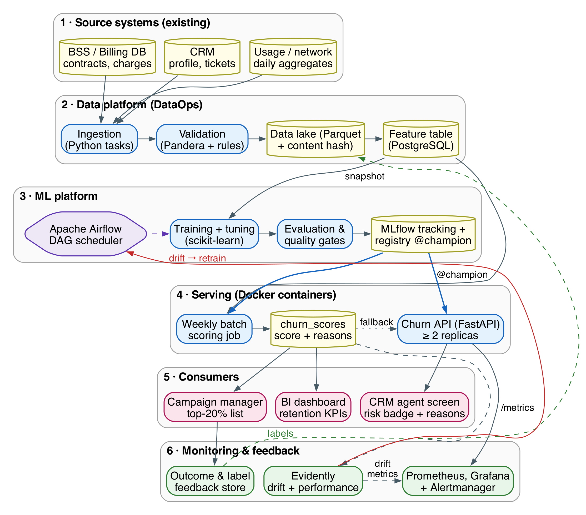
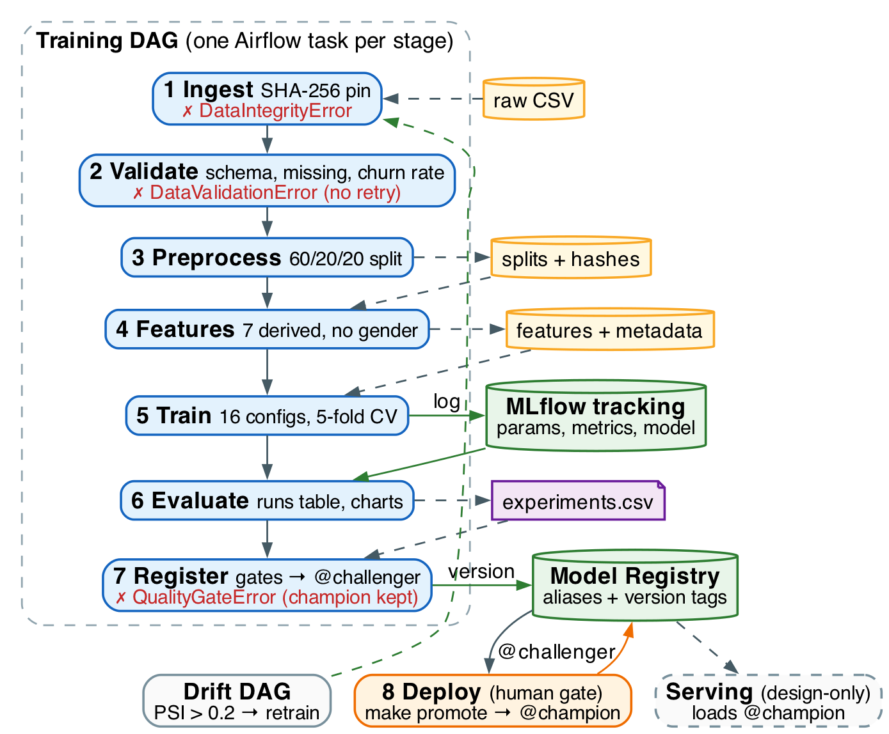
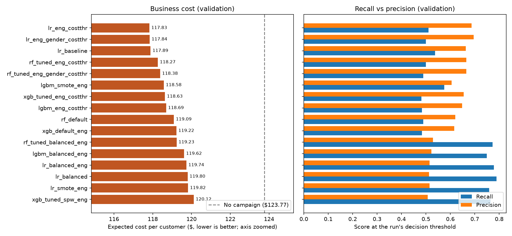
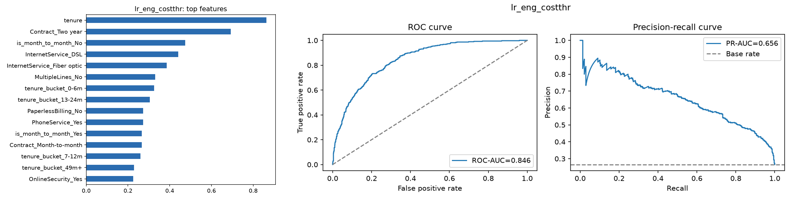

```{=html}
<section class="cover">
  <div class="cover-top">
    <p class="cover-course">DDM501 — AI in DevOps, DataOps, MLOps</p>
    <p class="cover-kind">Individual Assignment 2 · ML Pipeline Design &amp; MLOps Analysis</p>
  </div>
  <h1 class="cover-title">ChurnGuard</h1>
  <p class="cover-sub">From system design to a reproducible, orchestrated<br/>training pipeline for postpaid churn prediction</p>
  <table class="cover-meta">
    <tr><td>Student</td><td>Phạm Ngọc Hòa</td></tr>
    <tr><td>Student ID</td><td>hoa25ms13299</td></tr>
    <tr><td>Course</td><td>DDM501 — AI in DevOps, DataOps, MLOps</td></tr>
    <tr><td>Assignment</td><td>Individual Assignment 2 (5%)</td></tr>
    <tr><td>Builds on</td><td>Assignment 1 — ML System Design Document (ChurnGuard)</td></tr>
    <tr><td>Code</td><td><code>assignment02/code</code> · telco-churn-pipeline v1.1.0</td></tr>
    <tr><td>Evidence run</td><td>Airflow run <code>manual__2026-10-04T00:00:00+00:00</code> (16 MLflow runs)</td></tr>
    <tr><td>Date</td><td>October 2026</td></tr>
  </table>
  <p class="cover-note">Every experiment number in the tables is copied by <code>report/scripts/make_tables.py</code> from <code>code/reports/experiments.csv</code> (the export of the MLflow runs) and re-checked by <code>report/scripts/verify_numbers.py</code>. Code listings are excerpts of the repository files named in their captions; <code>...</code> marks omitted lines. Numbers marked <b>[A]</b> are business assumptions carried over from Assignment 1.</p>
</section>
```

# Executive Summary {.unnumbered .unlisted}

Assignment 1 designed **ChurnGuard**, a churn model for a hypothetical operator whose retention call centre can contact only 20% of customers. This report covers the training half of that design, now implemented in `assignment02/code`:

- **Pipeline.** Seven gated stages (ingest → validate → preprocess → features → train → evaluate → register) run as one Airflow DAG, monthly or as soon as a weekly drift DAG finds PSI > 0.2.
- **Tracking and registry.** Every run is tracked in MLflow. The selected model becomes `@challenger` in the `churnguard-classifier` registry, and `@champion` only after a human approves it.

**Experiments.** Sixteen configurations were run: four algorithms, two feature sets, three imbalance strategies, two threshold policies and two gender ablations. They were judged against gates derived from Assignment 1. Only **logistic regression on engineered features with a capacity-capped, cost-optimal threshold** (`lr_eng_costthr`) passes every gate. It has the lowest validation cost (USD 117.8287 per customer) and ties for the best Recall@top-20% (0.5160).

**Test results.** On the held-out test set the champion meets the A1 targets for Recall@top-20% (0.5027), ROC-AUC (0.8458), PR-AUC (0.6559) and Brier score (0.1358). Its F1 (0.5727) misses the A1 minimum. At NovaTel scale this is worth about USD 2.23 M per year of net retention margin [A].

**Reproducibility.** Two full executions agree to 2.78e-17 on all 39 non-timing metrics, and the Docker image reproduces the champion exactly. Open issues: the F1 gap, a senior-citizen recall gap that needs review, near-ties among the top runs, and an uncommitted working tree.

```{=html}
<div id="toc-placeholder"></div>
```

# Continuing from Assignment 1

## Problem Statement and Architecture (Recap)

> **Problem (A1).** The Retention team cannot reliably tell which 20% of postpaid customers are most likely to churn in the next 12 months. Its current rule-based list reaches only 38.7% of future churners at full call-centre capacity.

The A1 goal is to rank all customers weekly and hand the top 20% to Retention. The success criterion is **Recall@top-20% ≥ 0.50** on a held-out test set, with a hard minimum of 0.48 so that the model must beat the hand-made scorecard (0.476). The business case rests on the [A] economics: an offer costs USD 50, 25% of contacted churners are saved, and a retained customer is worth USD 466.27 of margin per year. Figure 1 shows the A1 architecture. This assignment implements the **offline training path** (A1 stages ①–⑦: ingestion to registry, plus human promotion) and the **drift-triggered retraining loop** from stage ⑨. Online serving (⑧) and the Prometheus/Grafana dashboards remain design-only; they consume the `@champion` alias that this pipeline maintains.

{width=56%}

## Refinements from Sessions 3–5

| Area | A1 design | A2 implementation | Reason |
|---|---|---|---|
| Data split | 70/15/15 | Stratified **60/20/20**, seed 42 | Validation now drives threshold tuning, gates and selection. 374 validation churners (instead of about 280) reduce the variance of those decisions. |
| Validation tool | Pandera | Custom `src/validation.py` (same rules) | Rules are plain, unit-tested Python, with one fewer dependency. Pandera remains the upgrade path. |
| Candidates | LogReg, RF, HistGB | LogReg, RF (≤ 300 trees), **XGBoost, LightGBM** (≤ 400 rounds, depth ≤ 6) | Standard boosted-tree libraries from the labs, with deterministic modes. Still within A1's complexity cap (≤ 500 iterations, depth ≤ 6). |
| Selection rule | Recall@top-20% primary; simplest model within 0.005 of the best | Recall@top-20% is a **hard gate**. Selection uses **expected cost per customer** at a capacity-capped threshold. The simplicity rule becomes USD 0.15 per customer. | Recall@top-20% ignores the threshold, but deployment needs one. Cost uses the same [A] economics and also penalises over-contacting (Section 2.2). |
| Fairness gate | Gender recall gap ≤ 0.05 | Gate on the **one-sided 95% lower confidence bound (LCB)** of the gap; the point gap is still reported | With about 187 churners per gender in validation, the gap's standard error is about 0.05. Validation point gaps range from 0.0475 to 0.1552 across runs, so a point gate would pick models by chance. |
| Gender feature | Excluded | Excluded, plus **two ablation runs** (`eligible: false`) | Measures the accuracy cost of excluding gender, as A1 Section 5.5 promised. |
| Retraining trigger | Monthly; early on PSI > 0.2 or rolling ROC-AUC drop > 0.03 (NFR‑8) | Monthly cron **or** an Airflow Dataset event from a weekly PSI DAG; the AUC trigger is **deferred** | Event-driven retraining without sensors (Session 5). The AUC trigger needs matured labels and served predictions, which only exist once serving runs. |
| Data snapshots | Parquet + hash | CSV + pinned SHA-256 of the raw file and of each split | The prototype source is one static file; the hashes give the same lineage guarantee. |

# ML Pipeline Design

## Pipeline Architecture

Figure 2 shows the implemented pipeline. Each stage is one command (`python -m src.pipeline <stage>`). Each stage reads files written by the stage before it, writes its own artefacts, and writes a JSON state file to `reports/pipeline_state/`. The same command is used by the Makefile, by every Airflow task and by the Docker image's entrypoint, so all three environments share one code path. The *deployment* stage of the brief is stage 8 in Figure 2: register publishes `@challenger`, a human **promote** moves `@champion`, and the A1 serving layer (design-only) loads whatever `@champion` points to.

{width=68%}

## Stage Specifications

| Stage | Purpose | Input → output | Key operations | Quality gate (on failure) |
|---|---|---|---|---|
| 1 Ingest | Obtain exactly the pinned data version | Source URL → raw CSV + manifest (sha256, rows) | Download only if missing; atomic `.part` rename; SHA-256 | Hash = `data.expected_sha256`, else `DataIntegrityError` (task retries ×3 for network errors) |
| 2 Validate | Stop bad data before training | Raw CSV → `validation_report.json` | 21-column schema and dtypes; allowed values; numeric ranges; duplicate IDs; ≤ 1% missing per column, blank `TotalCharges` only with tenure = 0; churn rate in [0.15, 0.40] (A1) | Any error → `DataValidationError`, no retry (bad data is deterministic); warnings logged (11 blank `TotalCharges`); any other null fails stage 4 |
| 3 Preprocess | Clean and split reproducibly | Raw → `data/interim/*.csv` + `split_manifest.json` | Cast `TotalCharges` (blank → 0 when tenure = 0); binary target; drop ID; stratified 60/20/20, seed 42 | Needs the validate state; records rows, churn rate and SHA-256 per split |
| 4 Features | Same feature code for training and serving | Interim → `data/processed/*.csv` + `feature_metadata.json` | 7 derived features (add-on count, average spend, charge delta, tenure bucket, month-to-month, auto-payment, family); gender excluded | Finite numerics, no missing categoricals, add-on count in [0, 6], else `ValueError` |
| 5 Train | Fit and log every experiment | Processed splits + config → one MLflow run each | `FeatureEngineer` → `ColumnTransformer` → [SMOTE] → model; 5-fold CV; capacity-capped threshold; val/test metrics; model + signature | Exceptions fail the task (retry ×1, 60 min timeout); lineage tags on every run |
| 6 Evaluate | One comparable table | Runs of this `pipeline_run_id` → `experiments.csv` + charts | `mlflow.search_runs`, sorted by the selection metric | Runs of exactly one pipeline execution |
| 7 Register (deploy) | Choose, version, publish | `experiments.csv` → model version, `@challenger`, `gate_report.csv` | Eligibility, 6 metric gates, beat baseline; simplicity rule; lineage tags on the version | No pass → `QualityGateError`, registry untouched |
| 8 Deploy (human; serving design-only) | Put the challenger into service | `@challenger` → `@champion`, `@previous_champion` | `make promote APPROVER=…`; serving loads `@champion`; `make rollback` reverts | Needs `--approved-by`; approver and time tagged on the version |

## Design Rationale

**Structure.** The seven stages map one-to-one onto A1 stages ①–⑦. Cheap checks run before expensive ones (hash, then schema, then training), so a bad input fails within seconds rather than after model fitting. Stages are coupled only through files and JSON state, never through memory. This makes every stage **idempotent and re-runnable on its own**: Airflow retries just the failed task, and a developer can run `python -m src.pipeline train --only lr_eng_costthr` without repeating ingestion.

**Modularity and reusability.** Each responsibility lives in one module (`data`, `validation`, `features`, `train`, `evaluate`, `register`, `drift`, `config`), written as functions of a `config` dict, with no hidden globals. Experiments are *data*: adding one is a YAML entry, not new code. The logged model is a single scikit-learn/imbalanced-learn `Pipeline` that includes the feature engineering. Serving therefore applies exactly the training transformations, so there is no training/serving skew, and the model signature is the 18 raw inputs from `raw_input_columns()` (gender excluded). Both DAGs build their tasks with one factory (`stage_task`, Section 3.3), and the drift check reuses the training cleaning code (`clean()`) and the training split as its reference.

**Error handling and recovery.** Failures are handled by class, not one-size-fits-all:

- **Transient errors** (network download) are retried three times with exponential backoff.
- **Deterministic data errors** (`DataIntegrityError`, `DataValidationError`) fail fast without a retry and raise an alert.
- **Training crashes or hangs** get one retry and a 60-minute timeout.
- **Quality failures** raise `QualityGateError`; nothing is registered, and the current champion keeps serving.
- **A bad model already in production** is fixed with `make rollback`, an alias switch back to `@previous_champion`. This drill was executed: v2 was promoted, rolled back to v1, then promoted again, so v2 is `@champion` and still carries the tag `rolled_back_reason`.

Partial runs are also safe. A stage refuses to start if its upstream state file is missing, and the download is atomic, so a crash never leaves a half-written input behind.

**Scalability.** The full pipeline (16 configurations) finishes in about 80 seconds inside the Docker image (log timestamps 19:19:32 → 19:20:51), so the current bottleneck is human review, not compute. The scaling path changes configuration rather than code:

- The MLflow backend moves from SQLite to PostgreSQL plus object storage through `TELCO__MLFLOW__TRACKING_URI` / `TELCO__MLFLOW__ARTIFACT_ROOT`.
- The training image can run each task on its own worker (Docker or Kubernetes operators), because Airflow only orchestrates; the ML dependencies live in a separate environment.
- The `train` task can fan out one task per experiment with dynamic task mapping when the matrix grows.
- At NovaTel scale (400,000 customers, A1 sizing), pandas still fits in memory. Spark becomes necessary only beyond about 10 M rows.

# Experiment Tracking & Metrics Analysis

## Experiment Design

**Variables.** The matrix varies five factors and holds everything else constant: the same split files (pinned hashes), seed 42, stratified 5-fold CV and the same metric code.

- *Algorithm:* logistic regression, random forest, XGBoost, LightGBM.
- *Hyperparameters:* library defaults versus regularised settings (shallower trees, minimum leaf size, subsampling, lower learning rate).
- *Features:* `base` (the 18 raw inputs) versus `engineered` (+7 derived features); `engineered_gender` is used for the ablation only.
- *Data preprocessing for class imbalance:* none, class weighting, or SMOTE (applied only inside the training folds).
- *Decision threshold:* fixed 0.50, or cost-optimal on validation subject to contacting ≤ 20% of customers.

**Baseline.** `lr_baseline` is a logistic regression (C = 1) on base features with no rebalancing and a 0.50 threshold. It is the simplest reasonable ML model, and the selection rule requires every challenger to beat it on the selection metric. The A1 non-ML baselines remain the external bar: the rule scorecard (Recall@top-20% 0.476, which the 0.48 gate encodes) and random targeting (0.210).

**Experiment matrix.** The 16 configurations are listed in Table 1. Fourteen are eligible candidates. E15–E16 repeat the two strongest cost-optimal set-ups *with* gender; they are logged with `eligible: false` so they can never be registered.

::: {.wide}
<!-- BEGIN:matrix -->
| ID | Run name | Algorithm | Features | Imbalance | Threshold | Hyperparameters | Role |
|---|---|---|---|---|---|---|---|
| E01 | `lr_baseline` | LogReg | base | none | fixed 0.50 | C=1 | Baseline |
| E02 | `lr_balanced` | LogReg | base | class wt. | fixed 0.50 | C=1 | Candidate |
| E03 | `lr_balanced_eng` | LogReg | engineered | class wt. | fixed 0.50 | C=0.5 | Candidate |
| E04 | `lr_smote_eng` | LogReg | engineered | smote | fixed 0.50 | C=0.5 | Candidate |
| E05 | `lr_eng_costthr` | LogReg | engineered | none | cost-opt. | C=0.5 | Candidate |
| E06 | `rf_default` | RandomForest | base | none | fixed 0.50 | trees=300 | Candidate |
| E07 | `rf_tuned_balanced_eng` | RandomForest | engineered | class wt. | fixed 0.50 | trees=300, depth=8, leaf=5, feat=sqrt | Candidate |
| E08 | `rf_tuned_eng_costthr` | RandomForest | engineered | none | cost-opt. | trees=300, depth=8, leaf=5, feat=sqrt | Candidate |
| E09 | `xgb_default_eng` | XGBoost | engineered | none | fixed 0.50 | trees=300, depth=6, lr=0.1 | Candidate |
| E10 | `xgb_tuned_spw_eng` | XGBoost | engineered | class wt. | fixed 0.50 | trees=400, depth=3, lr=0.05, sub=0.8, col=0.8, mcw=5 | Candidate |
| E11 | `xgb_tuned_eng_costthr` | XGBoost | engineered | none | cost-opt. | trees=400, depth=3, lr=0.05, sub=0.8, col=0.8, mcw=5 | Candidate |
| E12 | `lgbm_balanced_eng` | LightGBM | engineered | class wt. | fixed 0.50 | trees=400, lr=0.03, sub=0.8, col=0.8, leaves=15, mcs=30 | Candidate |
| E13 | `lgbm_smote_eng` | LightGBM | engineered | smote | fixed 0.50 | trees=400, lr=0.03, sub=0.8, col=0.8, leaves=15, mcs=30 | Candidate |
| E14 | `lgbm_eng_costthr` | LightGBM | engineered | none | cost-opt. | trees=400, lr=0.03, sub=0.8, col=0.8, leaves=15, mcs=30 | Candidate |
| E15 | `lr_eng_gender_costthr` | LogReg | eng.+gender | none | cost-opt. | C=0.5 | Ablation |
| E16 | `rf_tuned_eng_gender_costthr` | RandomForest | eng.+gender | none | cost-opt. | trees=300, depth=8, leaf=5, feat=sqrt | Ablation |
<!-- END:matrix -->
:::

*Table 1. Experiment matrix (`configs/config.yaml`; hyperparameters read back from the MLflow `model__*` params). trees = n_estimators, leaf = min_samples_leaf, feat = max_features, sub/col = row/column subsampling, mcw = min_child_weight, mcs = min_child_samples.*

## Metrics Strategy

**Primary metrics.** Two primary metrics play different roles:

1. **Recall@top-20%** is the A1 model goal and *primary success metric*: the share of all churners found in the 20% highest-scored customers. It is a hard gate on validation (≥ 0.48) and is judged on test against the A1 target (≥ 0.50).
2. **Expected business cost per customer** at the run's operating threshold, on validation, is the *selection metric*. It is computed from the confusion matrix with the A1 assumptions:

\[ \text{cost} = TP\,(c + (1-s)L) + FP\,c + FN\,L, \quad L = 64.76 \times 12 \times 0.6 = 466.27\,[A],\; c = 50\,[A],\; s = 0.25\,[A] \]

Contacting a customer pays off when \(p \ge c/(sL) = 0.429\) (break-even). Doing nothing costs every churner, which is USD 123.77 per validation customer. *Net savings per 1,000 customers* is the gap between that no-campaign cost and the model's cost. The two primary metrics agree under a fixed 20% capacity, because both reward finding churners *inside* the contacted segment. Cost additionally prices false positives, uses the threshold that will actually be deployed, and, together with the contact-rate gate, rules out models that would exceed call-centre capacity.

**Secondary metrics.** PR-AUC and ROC-AUC measure ranking quality independently of the threshold. Precision@top-20% shows how far the list clears the 0.43 break-even. F1, precision and recall describe the operating point. The Brier score measures calibration, which matters because the threshold is an expected-value cut on probabilities. Contact rate is the capacity check. The gender recall gap and its LCB are the fairness gate, and the senior-citizen gap is a fairness monitor. CV ROC-AUC std measures stability, and inference ms per 1,000 rows is the operational check. Accuracy is logged but never used (73.5% for "nobody churns").

**Business–model alignment.**

| Model metric | Business KPI (A1) | Link |
|---|---|---|
| Recall@top-20% | B1 effective churn, customers saved | +0.01 → about +265 saves and +USD 124 k per year [A] |
| Cost/customer, net savings per 1k | B2 campaign ROI / net margin | Net savings per 1k × 400 = yearly net margin for the 400 k base [A] |
| Contact rate | Call-centre capacity (80,000 contacts/yr) | Hard gate ≤ 0.20 |
| Precision@top-20% | ROI break-even | Must stay well above 0.43 |
| Gender gap LCB, senior gap | Legal/DPO fairness requirement | Gate ≤ 0.05; review if senior gap > 0.15 |
| Brier score | Trust in expected-value decisions | Gate ≤ 0.17, target ≤ 0.15 |

## MLflow Implementation

**Experiment setup.** The tracking backend and artifact root come from the config (SQLite and a local folder in development; overridable by environment variable). The experiment is created once, with project tags:

```{.python file="src/train.py"}
def setup_mlflow(config: dict[str, Any]) -> str:
    mlflow_cfg = config["mlflow"]
    mlflow.set_tracking_uri(mlflow_cfg["tracking_uri"])
    experiment = mlflow.get_experiment_by_name(mlflow_cfg["experiment_name"])
    if experiment is None:
        artifact_root = mlflow_cfg.get("artifact_root")
        location = None
        if artifact_root:
            location = artifact_root if "://" in artifact_root else Path(artifact_root).as_uri()
        experiment_id = mlflow.create_experiment(
            mlflow_cfg["experiment_name"],
            artifact_location=location,
            tags={"project": config["project"]["name"], "task": "binary-classification"},
        )
    else:
        experiment_id = experiment.experiment_id
    mlflow.set_experiment(experiment_id=experiment_id)
    return experiment_id
```

*Listing 1. `src/train.py` — experiment setup (docstring omitted).*

**Parameter, metric and artefact logging.** Each run carries lineage tags shared by the whole pipeline execution (`pipeline_run_id`, `data_sha256`, `git_sha`, `git_dirty`, `seed`). It also logs all hyperparameters as `model__*` params, 41 metrics (CV, validation, test, timing), evaluation plots, the experiment config, and the fitted pipeline with its signature and input example:

```{.python file="src/train.py"}
    with mlflow.start_run(run_name=experiment["name"]) as run:
        mlflow.set_tags(
            {
                **common_tags,
                "eligible_for_selection": str(eligible).lower(),
                ...
            }
        )
        mlflow.log_params(
            {
                "model": experiment["model"],
                "feature_set": experiment["feature_set"],
                ...
                **{f"model__{k}": v for k, v in experiment.get("params", {}).items()},
            }
        )
        ...
        mlflow.log_param("threshold", threshold)
        ...  # metrics = CV + compute_metrics() on val/test (41 values)
        mlflow.log_metrics(metrics)
        ...
            mlflow.log_artifacts(str(tmp_dir), artifact_path="evaluation")

        signature = infer_signature(x_val, pipeline.predict_proba(x_val))
        model_info = mlflow.sklearn.log_model(
            pipeline,
            name="model",
            signature=signature,
            input_example=x_val.head(5),
            code_paths=[str(PROJECT_ROOT / "src")],
            serialization_format="cloudpickle",
            pyfunc_predict_fn="predict_proba",
        )
        mlflow.set_tag("model_uri", model_info.model_uri)
```

*Listing 2. `src/train.py` — `run_experiment()` logging calls.*

**Model registration and versioning.** The register stage registers the selected run as a new version of `churnguard-classifier`. It tags that version with its evidence (metrics, threshold, data hash, git SHA, pipeline run) and moves only the `@challenger` alias. Promotion is a separate, human command that keeps the old champion under `@previous_champion`, so rollback is a single alias switch:

```{.python file="src/register.py"}
    version = mlflow.register_model(model_uri, name, tags={"run_name": challenger["run_name"]})
    version_tags = {
        "val_business_cost_per_customer": challenger["val_business_cost_per_customer"],
        ...
        "data_sha256": challenger["data_sha256"],
        "git_sha": challenger.get("git_sha", "unknown"),
        "pipeline_run_id": challenger["pipeline_run_id"],
        "validation_status": "passed",
        "approval_status": "pending",
    }
    for key, value in version_tags.items():
        client.set_model_version_tag(name, version.version, key, str(value))
    ...
    client.set_registered_model_alias(name, alias, version.version)

# ... promote_challenger(config, approved_by), run by `make promote APPROVER=...`
    previous = _alias_version(client, name, mlflow_cfg["champion_alias"])
    if previous and previous != challenger:
        client.set_registered_model_alias(name, mlflow_cfg["previous_alias"], previous)
    client.set_registered_model_alias(name, mlflow_cfg["champion_alias"], challenger)
```

*Listing 3. `src/register.py` — `register_challenger()` and `promote_challenger()`.*

{width=94%}

## Results

Table 2 lists all 16 runs of the Airflow execution `manual__2026-10-04T00:00:00+00:00`, sorted by the selection metric. All values are validation metrics, which are the only ones used for decisions. Table 3 gives the held-out test metrics, which are reported but never used for selection.

::: {.wide}
<!-- BEGIN:results_val -->
| # | Run | Thr. | Cost/cust. (USD) | R@20 | P@20 | PR-AUC | ROC-AUC | F1 | Contact | Brier | Gap LCB | Failed gates |
|---:|---|---:|---:|---:|---:|---:|---:|---:|---:|---:|---:|---|
| 1 | `lr_eng_costthr` | 0.51 | 117.8287 | 0.5160 | 0.6844 | 0.6499 | 0.8381 | 0.5859 | 0.1973 | 0.1374 | 0.0394 | **all passed** |
| 2 | `lr_eng_gender_costthr` | 0.52 | 117.8402 | 0.5134 | 0.6809 | 0.6494 | 0.8378 | 0.5816 | 0.1909 | 0.1375 | 0.0603 | ineligible, fairness |
| 3 | `lr_baseline` | 0.50 | 117.8885 | 0.5107 | 0.6773 | 0.6434 | 0.8365 | 0.5938 | 0.2150 | 0.1380 | 0.0306 | capacity, baseline |
| 4 | `rf_tuned_eng_costthr` | 0.50 | 118.2660 | 0.5027 | 0.6667 | 0.6480 | 0.8391 | 0.5710 | 0.1994 | 0.1371 | 0.0712 | fairness, baseline |
| 5 | `rf_tuned_eng_gender_costthr` | 0.50 | 118.3841 | 0.4973 | 0.6596 | 0.6444 | 0.8368 | 0.5639 | 0.1952 | 0.1380 | 0.0056 | ineligible, baseline |
| 6 | `lgbm_smote_eng` | 0.50 | 118.5756 | 0.4813 | 0.6383 | 0.6285 | 0.8307 | 0.5898 | 0.2520 | 0.1445 | 0.0121 | capacity, baseline |
| 7 | `xgb_tuned_eng_costthr` | 0.51 | 118.6322 | 0.4920 | 0.6525 | 0.6372 | 0.8327 | 0.5547 | 0.1952 | 0.1406 | 0.0321 | baseline |
| 8 | `lgbm_eng_costthr` | 0.50 | 118.6915 | 0.4840 | 0.6418 | 0.6372 | 0.8321 | 0.5544 | 0.1980 | 0.1414 | 0.0160 | baseline |
| 9 | `rf_default` | 0.50 | 119.0938 | 0.4733 | 0.6277 | 0.6047 | 0.8126 | 0.5471 | 0.2094 | 0.1489 | 0.0000 | R@20, ROC, capacity, baseline |
| 10 | `xgb_default_eng` | 0.50 | 119.2237 | 0.4733 | 0.6277 | 0.6057 | 0.8100 | 0.5419 | 0.2087 | 0.1543 | 0.0376 | R@20, ROC, capacity, baseline |
| 11 | `rf_tuned_balanced_eng` | 0.50 | 119.2314 | 0.5027 | 0.6667 | 0.6459 | 0.8394 | 0.6283 | 0.3875 | 0.1580 | 0.0000 | capacity, baseline |
| 12 | `lgbm_balanced_eng` | 0.50 | 119.6211 | 0.4947 | 0.6560 | 0.6360 | 0.8331 | 0.6154 | 0.3804 | 0.1612 | 0.0000 | capacity, baseline |
| 13 | `lr_balanced_eng` | 0.50 | 119.7401 | 0.5080 | 0.6738 | 0.6493 | 0.8385 | 0.6198 | 0.4010 | 0.1661 | 0.0066 | capacity, baseline |
| 14 | `lr_balanced` | 0.50 | 119.7996 | 0.5160 | 0.6844 | 0.6426 | 0.8366 | 0.6211 | 0.4088 | 0.1678 | 0.0303 | capacity, baseline |
| 15 | `lr_smote_eng` | 0.50 | 119.8224 | 0.5080 | 0.6738 | 0.6433 | 0.8381 | 0.6141 | 0.3911 | 0.1627 | 0.0000 | capacity, baseline |
| 16 | `xgb_tuned_spw_eng` | 0.50 | 120.1183 | 0.5000 | 0.6631 | 0.6356 | 0.8350 | 0.6098 | 0.4003 | 0.1642 | 0.0000 | capacity, baseline |
<!-- END:results_val -->
:::

*Table 2. Validation results (1,409 customers, 374 churners). R@20 / P@20 = recall / precision in the top 20%; Contact = share of customers above the threshold; Gap LCB = 95% lower bound of the gender recall gap. Failed gates: R@20 < 0.48, ROC < 0.83, PR < 0.60, capacity = contact > 0.20, fairness = gap LCB > 0.05, baseline = not cheaper than `lr_baseline`, ineligible = ablation run.*

::: {.wide}
<!-- BEGIN:results_test -->
| Run | Cost/cust. (USD) | R@20 | P@20 | PR-AUC | ROC-AUC | F1 | Contact | Brier | Gender gap | CV ROC-AUC | ms/1k |
|---|---:|---:|---:|---:|---:|---:|---:|---:|---:|---:|---:|
| `lr_eng_costthr` | 118.1951 | 0.5027 | 0.6667 | 0.6559 | 0.8458 | 0.5727 | 0.1980 | 0.1358 | 0.0161 | 0.8505 ± 0.0130 | 10.20 |
| `lr_eng_gender_costthr` | 118.1831 | 0.5053 | 0.6702 | 0.6555 | 0.8459 | 0.5710 | 0.1945 | 0.1358 | 0.0050 | 0.8502 ± 0.0130 | 10.03 |
| `lr_baseline` | 117.8537 | 0.5027 | 0.6667 | 0.6342 | 0.8427 | 0.6026 | 0.2292 | 0.1378 | 0.0682 | 0.8485 ± 0.0107 | 6.01 |
| `rf_tuned_eng_costthr` | 118.7272 | 0.4893 | 0.6489 | 0.6551 | 0.8418 | 0.5567 | 0.2037 | 0.1366 | 0.0209 | 0.8474 ± 0.0119 | 35.35 |
| `rf_tuned_eng_gender_costthr` | 118.5262 | 0.4947 | 0.6560 | 0.6534 | 0.8419 | 0.5636 | 0.2030 | 0.1367 | 0.0427 | 0.8470 ± 0.0119 | 40.28 |
| `lgbm_smote_eng` | 118.1151 | 0.4920 | 0.6525 | 0.6536 | 0.8390 | 0.6102 | 0.2626 | 0.1408 | 0.0015 | 0.8381 ± 0.0121 | 15.73 |
| `xgb_tuned_eng_costthr` | 118.2778 | 0.5053 | 0.6702 | 0.6472 | 0.8416 | 0.5697 | 0.1980 | 0.1370 | 0.0216 | 0.8413 ± 0.0099 | 10.02 |
| `lgbm_eng_costthr` | 118.4557 | 0.5027 | 0.6667 | 0.6450 | 0.8383 | 0.5714 | 0.2115 | 0.1383 | 0.0009 | 0.8377 ± 0.0105 | 14.19 |
| `rf_default` | 119.1295 | 0.4706 | 0.6241 | 0.6151 | 0.8198 | 0.5495 | 0.2150 | 0.1477 | 0.0319 | 0.8229 ± 0.0133 | 34.11 |
| `xgb_default_eng` | 119.1883 | 0.4733 | 0.6277 | 0.6194 | 0.8212 | 0.5427 | 0.2079 | 0.1486 | 0.0150 | 0.8234 ± 0.0114 | 11.39 |
| `rf_tuned_balanced_eng` | 119.0424 | 0.4973 | 0.6596 | 0.6559 | 0.8421 | 0.6342 | 0.3903 | 0.1574 | 0.0343 | 0.8467 ± 0.0118 | 37.42 |
| `lgbm_balanced_eng` | 119.3846 | 0.4893 | 0.6489 | 0.6496 | 0.8389 | 0.6211 | 0.3790 | 0.1577 | 0.0913 | 0.8392 ± 0.0099 | 14.53 |
| `lr_balanced_eng` | 119.9297 | 0.5107 | 0.6773 | 0.6568 | 0.8462 | 0.6192 | 0.4131 | 0.1648 | 0.0401 | 0.8506 ± 0.0140 | 9.54 |
| `lr_balanced` | 120.0360 | 0.5027 | 0.6667 | 0.6338 | 0.8424 | 0.6155 | 0.4102 | 0.1678 | 0.0021 | 0.8482 ± 0.0118 | 5.89 |
| `lr_smote_eng` | 120.0003 | 0.5053 | 0.6702 | 0.6540 | 0.8451 | 0.6144 | 0.4045 | 0.1625 | 0.0498 | 0.8502 ± 0.0148 | 10.33 |
| `xgb_tuned_spw_eng` | 119.4092 | 0.5080 | 0.6738 | 0.6580 | 0.8420 | 0.6283 | 0.4010 | 0.1596 | 0.0560 | 0.8408 ± 0.0108 | 10.11 |
<!-- END:results_test -->
:::

*Table 3. Held-out test results (1,409 customers), with 5-fold CV ROC-AUC on the training split (mean ± std) and scoring latency in ms per 1,000 rows.*

{width=82%}

**Patterns.**

1. **The decision threshold matters more than the algorithm.** All seven runs that rebalance classes with a fixed 0.50 threshold contact between 0.2520 and 0.4088 of customers, so all of them break the capacity gate. They include the best F1 (up to 0.6283), yet six of them are the six most expensive runs (USD 119.2314 to 120.1183). Rebalancing pushes probabilities upward, so many customers below the 0.429 break-even get contacted. With the capacity cap, cost-optimal thresholds land between 0.50 and 0.52: the cap, not the break-even, is the binding constraint.
2. **Ranking quality is nearly tied once tree models are regularised.** Every run except the two untuned tree defaults reaches a validation ROC-AUC between 0.8307 and 0.8394 and a PR-AUC between 0.6285 and 0.6499. The untuned tree models overfit: `rf_default` (ROC-AUC 0.8126) and `xgb_default_eng` (0.8100) fail both the ROC-AUC and Recall@top-20% gates. Regularisation (depth 8, leaf 5) raises random forest ROC-AUC from 0.8126 to 0.8391.
3. **Feature engineering gives small, consistent gains for the linear model.** PR-AUC rises from 0.6434 (`lr_baseline`) to 0.6499 (`lr_eng_costthr`), and from 0.6426 to 0.6493 for the class-weighted pair. C also changes (1.0 → 0.5), so the gain is partly confounded with stronger regularisation.
4. **SMOTE is never better than class weighting.** It gives PR-AUC 0.6433 against 0.6493 for logistic regression and 0.6285 against 0.6360 for LightGBM. It also costs reproducibility: SMOTE runs differ between macOS and the Linux image (Table 7).
5. **Excluding gender costs nothing measurable (Table 4).** The differences are at most USD 0.2010 per customer and 0.0036 PR-AUC, with mixed signs between validation and test, which is within noise. The A1 privacy decision is therefore kept at no accuracy cost.

::: {.wide}
<!-- BEGIN:ablation -->
| Family | Metric | Without gender | With gender | Δ (with − without) |
|---|---|---:|---:|---:|
| LogReg | Val cost/cust. (USD) | 117.8287 | 117.8402 | +0.0115 |
| LogReg | Val PR-AUC | 0.6499 | 0.6494 | -0.0005 |
| LogReg | Val R@20 | 0.5160 | 0.5134 | -0.0026 |
| LogReg | Test cost/cust. (USD) | 118.1951 | 118.1831 | -0.0120 |
| LogReg | Test PR-AUC | 0.6559 | 0.6555 | -0.0004 |
| RandomForest | Val cost/cust. (USD) | 118.2660 | 118.3841 | +0.1181 |
| RandomForest | Val PR-AUC | 0.6480 | 0.6444 | -0.0036 |
| RandomForest | Val R@20 | 0.5027 | 0.4973 | -0.0054 |
| RandomForest | Test cost/cust. (USD) | 118.7272 | 118.5262 | -0.2010 |
| RandomForest | Test PR-AUC | 0.6551 | 0.6534 | -0.0017 |
<!-- END:ablation -->
:::

*Table 4. Gender ablation (E15–E16 versus their gender-free counterparts).*

**Metric trade-offs.** *F1 versus cost:* F1 weighs precision and recall equally and ignores capacity, so the best-F1 runs are the most expensive. *ROC-AUC versus selection:* `rf_tuned_balanced_eng` has the highest validation ROC-AUC (0.8394) but would contact 0.3875 of customers. `rf_tuned_eng_costthr` ranks almost as well (0.8391) but fails the fairness LCB (0.0712). *Calibration:* class weighting worsens the Brier score (0.1580–0.1678, and 0.1445–0.1627 with SMOTE) compared with 0.1371–0.1414 for the regularised runs without rebalancing. That undermines expected-value thresholds. *Latency:* random forests score at 34–41 ms per 1,000 rows, about 3–4× slower than logistic regression (about 10 ms), though all are far inside the A1 budget. *Fairness:* most runs show large validation point gaps that vanish on test (e.g. the champion's 0.1238 becomes 0.0161). This is why the gate uses the LCB.

**Recommendation.** Use **`lr_eng_costthr`**: logistic regression with C = 0.5 on engineered features, no rebalancing, and threshold 0.51. It is the challenger and current champion (registry version 2). The reasons:

- It is the only run of 16 that passes every gate.
- It has the lowest validation cost (USD 117.8287 per customer, i.e. USD 5,936 net savings per 1,000 customers) and ties for the best validation Recall@top-20% (0.5160), so the A1 primary metric and the selection metric agree.
- It is the simplest family, well calibrated (Brier 0.1374), and stable (CV ROC-AUC std 0.0130).
- Its coefficients give the reason codes that A1 requires for the agent script (Figure 5).
- On test it meets every A1 target except F1 (Table 5). Its test net savings of USD 5,569.99 per 1,000 customers scale to about USD 2.23 M per year for the 400 k base [A], in line with the A1 target of +USD 2.19 M.

::: {.wide}
<!-- BEGIN:champion -->
| Metric (A1 Section 3.4) | A1 min / target | Validation | Test | Status (test) |
|---|---|---:|---:|---|
| Recall@top-20% | ≥ 0.48 / ≥ 0.50 | 0.5160 | 0.5027 | meets target |
| Precision@top-20% | ≥ 0.60 / ≥ 0.66 | 0.6844 | 0.6667 | meets target |
| ROC-AUC | ≥ 0.83 / ≥ 0.84 | 0.8381 | 0.8458 | meets target |
| PR-AUC | ≥ 0.60 / ≥ 0.64 | 0.6499 | 0.6559 | meets target |
| F1 at operating threshold | ≥ 0.58 / ≥ 0.62 | 0.5859 | 0.5727 | **below minimum** |
| Brier score | ≤ 0.17 / ≤ 0.15 | 0.1374 | 0.1358 | meets target |
| Gender recall gap (point) | ≤ 0.05 | 0.1238 | 0.0161 | meets target; val gated on LCB 0.0394 |
| Senior recall gap (monitor) | review if > 0.15 | 0.2238 | 0.1244 | **review flagged (val)** |
| CV ROC-AUC std (5-fold) | < 0.02 | 0.0130 | n/a | ok |
<!-- END:champion -->
:::

*Table 5. Champion (`lr_eng_costthr`) against the A1 model goals.*

{width=90%}

**Honest caveats.**

- *F1 (0.5727) is below the A1 minimum of 0.58.* The capacity cap forces a high threshold, which limits recall at the threshold to 0.5000 on test. Recall@top-20%, the primary metric, is unaffected. F1 is retained as a monitored metric, and the A1 F1 goal should be restated as "at ≤ 20% contact".
- *The senior-citizen recall gap is 0.2238 on validation* (above the 0.15 review line), and 0.1244 on test. Base churn rates differ (41.7% versus 23.6%), so this is flagged for the fairness review that A1 prescribes rather than silently accepted.
- *The top three runs differ by only USD 0.0598 per customer on validation*, which is less than sampling noise, and on test `lr_baseline` is cheaper (117.8537 versus 118.1951) but contacts 0.2292 of customers, above capacity. The choice is therefore driven by the gates and the simplicity rule, not by a meaningful cost gap.

# Workflow Orchestration Design

## DAG Architecture

Two DAGs (Figure 6) are linked by an Airflow **Dataset**. `telco_churn_drift_monitor` is the weekly drift check. `telco_churn_training` is the seven-stage pipeline, and its schedule is "cron *or* dataset event". All tasks share `DEFAULT_ARGS` (Section 3.4): retries, backoff, timeout and callbacks.

{width=100%}

| DAG | Task | Operator | What it does | Retries / timeout |
|---|---|---|---|---|
| training | `ingest` | BashOperator | Download if missing and verify SHA-256 | 3 / 10 min |
| training | `validate` | BashOperator | Schema, domain, range and label-rate checks | 0 / 10 min |
| training | `preprocess` | BashOperator | Clean data; stratified 60/20/20 split with hashes | 2 / 10 min |
| training | `features` | BashOperator | Materialise derived features and run the feature gate | 2 / 10 min |
| training | `train` | BashOperator | Train and log all (or `params.experiments`) configurations | 1 / 60 min |
| training | `evaluate` | BashOperator | Export `experiments.csv` and charts | 2 / 10 min |
| training | `register` | BashOperator | Gates, selection, registry version, `@challenger` | 1 / 10 min |
| drift | `drift` | BashOperator | PSI of every production feature against the training split | 2 / 10 min |
| drift | `drift_detected` | ShortCircuitOperator | Continue only if any PSI > 0.2 | default |
| drift | `emit_drift_alert` | PythonOperator | Alert and publish the `DRIFT_ALERT` dataset (outlet) | default |

**Dependencies.** The training chain is strictly linear because every stage consumes the files of the stage before it: validate needs the raw file, preprocess needs a passed validation, and so on to register, which needs the exported table. Running stages in parallel would gain nothing at this data size. The only cross-DAG dependency is data-aware: `emit_drift_alert` declares `outlets=[DRIFT_ALERT]`, and the training DAG lists the same dataset in its schedule, so neither DAG polls the other. Promotion is deliberately **not** a task. A1's automation-versus-control decision automates everything up to `@challenger` and leaves `@champion` to a person.

## Scheduling Strategy

| Trigger | Type | Frequency | Rationale |
|---|---|---|---|
| `CronTriggerTimetable("0 2 1 * *")` | Time-based | Monthly, 1st at 02:00 (Asia/Ho_Chi_Minh) | New churn labels accumulate monthly (A1 "monthly retrain"); off-peak hours |
| `DRIFT_ALERT` dataset event | Data-aware (event) | As soon as the drift DAG publishes | Meets A1 S3: drift detected within ≤ 7 days, retrain without waiting for month end |
| Drift monitor cron `0 1 * * 1` | Time-based | Weekly, Monday 01:00 | Runs after the nightly extract and before the Monday 06:00 batch scoring (A1 S1) |
| Manual (`params.experiments`) | Ad hoc | On demand | Re-run a subset of experiments, e.g. after a config change |

A1's second early trigger (rolling ROC-AUC drop > 0.03, NFR‑8) is deferred: it needs matured churn labels joined to served predictions, which only exist once the serving layer runs; the PSI trigger is implemented. `catchup=False` prevents back-filling missed months, because only the latest data matters. `max_active_runs=1` stops a cron run and a drift run from writing the same reports and registry concurrently, and `dagrun_timeout` (2 h for training, 30 min for drift) bounds a hung run.

## Code: DAG and Task Definitions

```{.python file="dags/telco_churn_training_dag.py"}
with DAG(
    dag_id="telco_churn_training",
    description="Monthly or drift-triggered retraining; registers a @challenger",
    default_args=DEFAULT_ARGS,
    schedule=DatasetOrTimeSchedule(
        timetable=CronTriggerTimetable("0 2 1 * *", timezone=TIMEZONE),
        datasets=[DRIFT_ALERT],
    ),
    start_date=pendulum.datetime(2026, 9, 1, tz=TIMEZONE),
    catchup=False,
    max_active_runs=1,
    dagrun_timeout=timedelta(hours=2),
    on_success_callback=notify_success,
    params={"experiments": []},
    tags=["ddm501", "churn", "training"],
    doc_md=__doc__,
) as dag:
    ingest = stage_task("ingest", retries=3)  # network download: retry transient errors
    validate = stage_task("validate", retries=0)  # bad data is deterministic: fail fast
    preprocess = stage_task("preprocess")
    features = stage_task("features")
    train = stage_task(
        "train",
        extra_args=(
            "--only {{ params.experiments | join(' ') }}"
        ),
        execution_timeout=timedelta(minutes=60),
        retries=1,
    )
    evaluate = stage_task("evaluate")
    register = stage_task("register", retries=1)

    ingest >> validate >> preprocess >> features >> train >> evaluate >> register
```

*Listing 4. `dags/telco_churn_training_dag.py` — DAG, tasks and dependencies.*

```{.python file="dags/telco_churn_drift_dag.py"}
    check = stage_task("drift", retries=2)
    gate = ShortCircuitOperator(task_id="drift_detected", python_callable=drift_detected)
    alert = PythonOperator(
        task_id="emit_drift_alert", python_callable=emit_drift_alert, outlets=[DRIFT_ALERT]
    )

    check >> gate >> alert
```

*Listing 5. `dags/telco_churn_drift_dag.py` — drift tasks (schedule `"0 1 * * 1"`).*

Every pipeline task is built by one factory, `stage_task()` in `dags/churnguard_common.py`. It creates a BashOperator that runs `python -m src.pipeline <stage>` with the project's own interpreter (`TELCO_PYTHON`), so Airflow 2.10.5 lives in a separate virtual environment with no ML dependencies. It also passes Airflow's `{{ run_id }}` down as `TELCO_PIPELINE_RUN_ID`, which becomes the `pipeline_run_id` tag on every MLflow run.

## Operational Considerations

**Failure handling.** The defaults retry twice with exponential backoff (5 min growing to at most 30 min) and give each task a 10-minute timeout. Per-task overrides then encode the error classes of Section 1.3: no retry for validation, three for ingestion, and one retry with 60 minutes for training.

```{.python file="dags/churnguard_common.py"}
DEFAULT_ARGS: dict[str, Any] = {
    "owner": "retention-ml",
    "depends_on_past": False,
    "retries": 2,
    "retry_delay": timedelta(minutes=5),
    "retry_exponential_backoff": True,
    "max_retry_delay": timedelta(minutes=30),
    "execution_timeout": timedelta(minutes=10),
    "on_failure_callback": notify_failure,
    "on_retry_callback": notify_retry,
}
```

*Listing 6. `dags/churnguard_common.py` — shared failure policy.*

**Alerting.** Four events are routed:

- `notify_failure` writes a structured `ALERT` log line (DAG, task, try, exception, log URL) and posts it to a Slack-compatible webhook (`ALERT_WEBHOOK_URL`).
- `notify_retry` only logs a warning, so retries do not page anyone.
- The training DAG's `on_success_callback` announces the new challenger and the exact promote command to run.
- `emit_drift_alert` reports the drifted features and maximum PSI.

The webhook accepts only `https://` URLs, and a delivery error never fails the task.

**Monitoring.** The Airflow UI and metadata DB give run state, task durations and retry counts, and the timeouts turn silent hangs into visible failures. MLflow gives model-quality trends across monthly runs, because each run is tagged with its `pipeline_run_id`. The drift report (`drift_report.json`) keeps the PSI of every feature for trend analysis, and the registry tags record which version serves and who approved it. Serving-side metrics (latency, fallbacks, score drift) belong to the A1 Prometheus/Evidently layer.

**Verified behaviour** (Airflow 2.10.5, `reports/ops_evidence/airflow_evidence.txt`). There are no DAG import errors, and the timetables resolve to "Triggered by datasets or At 02:00, on day 1 of the month" and "At 01:00, only on Monday". `airflow dags test telco_churn_training` ran all seven tasks to `state=success` and registered version 2. On a **simulated** drifted snapshot (35% of one- and two-year contract customers moved to month-to-month, charges +12%), the drift DAG found maximum PSI 0.8416 (`MonthlyCharges`), emitted the alert and recorded the dataset event, and the metadata DB showed `telco_churn_training` queued by it. On the real snapshot (maximum PSI 0.0017), `drift_detected` short-circuited.

# Code Quality & Documentation

## Code Standards

| Aspect | Standard | Enforcement and evidence |
|---|---|---|
| Style | PEP 8 via **black** (line length 100) and **ruff** rules E, F, W, I, N, UP, B, D, S, SIM (pycodestyle, pyflakes, isort, naming, pyupgrade, bugbear, docstrings, bandit security, simplify) | `make lint`: ruff reports no issues; black leaves all 20 files unchanged (`src`, `tests`, `dags`, `scripts`) |
| Docstrings | Google style on every public module, class and function (Args / Returns / Raises) | ruff `D` rules with `convention = "google"` |
| Type hints | Full signatures with PEP 604/585 syntax (`dict[str, Any]`, `str \| None`), `from __future__ import annotations` | Every function signature in `src`, `dags` and `scripts` |
| Comments | Explain *why* (constraints, security exceptions), never *what*; every `noqa` states its reason | e.g. `# noqa: S310 - pinned https URL`, `# bad data is deterministic: fail fast` |
| Tests | pytest: config overrides, business-cost and break-even, capacity-capped threshold, recall gap and LCB, gate report, simplicity rule, feature exclusion, validation rules, drift | `make test`: **36 passed** |

```{.toml file="pyproject.toml"}
[tool.ruff.lint]
select = ["E", "F", "W", "I", "N", "UP", "B", "D", "S", "SIM"]
ignore = ["D203", "D213", "D105", "D107"]

[tool.ruff.lint.pydocstyle]
convention = "google"
```

*Listing 7. `pyproject.toml` — lint policy.*

Listing 8 shows the house style on one function: full type hints and a Google docstring that states the statistical definition.

```{.python file="src/evaluate.py"}
def recall_gap(
    y_true: np.ndarray, y_pred: np.ndarray, groups: np.ndarray, z: float = 1.645
) -> tuple[float, float]:
    """Equal-opportunity gap: largest recall difference between groups.

    Args:
        y_true: Binary ground truth.
        y_pred: Binary decisions.
        groups: Group label per row (e.g. gender).
        z: Normal quantile for the one-sided lower confidence bound (1.645 = 95%).

    Returns:
        ``(gap, lower_bound)`` where ``gap = max(recall_g) - min(recall_g)`` over groups
        with positives and ``lower_bound`` subtracts ``z`` standard errors of the
        difference of two proportions (clipped at 0).
    """
    ...
    std_err = np.sqrt(r_hi * (1 - r_hi) / n_hi + r_lo * (1 - r_lo) / n_lo)
    return float(gap), float(max(0.0, gap - z * std_err))
```

*Listing 8. `src/evaluate.py` — fairness metric with docstring and type hints.*

## Configuration

**Config file.** A single YAML file is the source of truth for paths, data pin, validation rules, MLflow names, business assumptions, drift and selection policy, and the experiment matrix. Assumptions are labelled as such, with their formulas:

```{.yaml file="configs/config.yaml"}
# Business assumptions (NOT measured data), identical to Assignment 1, Section 1.1.
#   churn_loss   = 12 months x mean MonthlyCharges ($64.76) x 60% gross margin = $466.27
business:
  churn_loss: 466.27
  offer_cost: 50.0
  offer_success_rate: 0.25
  # Retention call-centre capacity: at most 20% of the base per cycle.
  top_k_fraction: 0.20
  max_contact_rate: 0.20
...
selection:
  metric: val_business_cost_per_customer
  mode: min
  tie_breaker: val_pr_auc
  gates:
    val_recall_at_top_k: 0.48   # must beat the rule scorecard (0.476)
    val_roc_auc: 0.83
    val_pr_auc: 0.60
  max_gates:
    val_contact_rate: 0.20      # call-centre capacity
    val_gender_recall_gap_lcb: 0.05
    val_brier: 0.17
  baseline_experiment: lr_baseline
  simplicity_tolerance: 0.15
  complexity_order: [logistic_regression, random_forest, lightgbm, xgboost]
...
  - name: lr_eng_costthr
    model: logistic_regression
    feature_set: engineered
    imbalance: none
    threshold: cost_optimal
    params: {C: 0.5, max_iter: 2000}
```

*Listing 9. `configs/config.yaml` — business assumptions, selection policy and one experiment entry. The simplicity tolerance is A1's "0.005 Recall@top-20%" in dollars: 0.005 × 374 churners × USD 116.57 per FP→TP swap ÷ 1,409 customers ≈ 0.15 [A].*

**Loading and environment overrides.** `load_config()` reads the YAML (path from the `TELCO_CONFIG` environment variable or the default), applies overrides, and resolves relative paths and SQLite URIs against the project root. Any key can be overridden by a `TELCO__<SECTION>__<KEY>` variable whose value is parsed as YAML, so types survive:

```{.python file="src/config.py"}
def apply_env_overrides(
    config: dict[str, Any], environ: dict[str, str] | None = None
) -> dict[str, Any]:
    ...
    environ = dict(os.environ) if environ is None else environ
    result = copy.deepcopy(config)
    for name, raw_value in sorted(environ.items()):
        if not name.startswith(ENV_PREFIX):
            continue
        keys = [part.lower() for part in name[len(ENV_PREFIX) :].split("__") if part]
        if keys:
            _set_nested(result, keys, yaml.safe_load(raw_value))
    return result
...
    config_path = Path(path or environ.get("TELCO_CONFIG", DEFAULT_CONFIG_PATH))
    with config_path.open(encoding="utf-8") as handle:
        config = yaml.safe_load(handle)
    config = apply_env_overrides(config, environ)
    return _resolve_paths(config, PROJECT_ROOT)
```

*Listing 10. `src/config.py` — override mechanism and loader.*

| Environment variable | Used by | Example in this project |
|---|---|---|
| `TELCO__MLFLOW__TRACKING_URI`, `TELCO__MLFLOW__ARTIFACT_ROOT` | Pipeline | `make docker-train` points MLflow at a Docker volume |
| `TELCO__PATHS__DRIFT_CURRENT_DATA` | Drift check | `make airflow-test-drift SNAPSHOT=...` injects the simulated snapshot |
| `TELCO_PIPELINE_RUN_ID` | Pipeline | Set from Airflow's `{{ run_id }}`; groups the 16 runs |
| `TELCO_PYTHON`, `TELCO_PROJECT_DIR` | DAGs | Interpreter and project used by the BashOperators |
| `TELCO_GIT_SHA`, `TELCO_GIT_DIRTY` | Lineage | Baked into the Docker image at build time |
| `ALERT_WEBHOOK_URL` | Callbacks | Slack-compatible webhook (https only); never committed |

# Reproducibility & Versioning Strategy

## Code Versioning

**Branching and releases.** The branching model is trunk-based:

- `main` is protected. Work happens on short-lived `feature/*` and `fix/*` branches, merged by pull request after CI passes: `make lint`, `make test`, DAG import (`make dag-check`) and a smoke train (`--only lr_baseline`).
- Releases are **SemVer tags** `vMAJOR.MINOR.PATCH`, kept equal to `pyproject.toml` (currently 1.1.0) and to the image tag (`churnguard-train:1.1.0`). MAJOR means a breaking change to the model input schema, MINOR means new features, experiments or stages, and PATCH means fixes.
- Code and models are released independently, as A1 specifies: code by image tag, models by registry alias.

```bash
git switch -c feature/drift-trigger            # short-lived branch from main
make lint test dag-check                       # same checks as CI
git tag -a v1.1.0 -m "drift-triggered retraining, gated challenger"   # after merge to main
make docker-build IMAGE=churnguard-train:1.1.0 # image records the tagged commit
```

Every MLflow run records the exact code version: `git_sha` and `git_dirty` come from `git_metadata()`, or from the build arguments baked into the image, where git is not available.

```{.python file="src/train.py"}
    baked_sha = os.environ.get("TELCO_GIT_SHA")
    if baked_sha:  # set at image build time; containers ship without git
        return {"git_sha": baked_sha, "git_dirty": os.environ.get("TELCO_GIT_DIRTY", "unknown")}
    ...
    try:
        sha = _git("rev-parse", "HEAD")
        dirty = bool(_git("status", "--porcelain", "--", "."))
    except (OSError, subprocess.CalledProcessError):
        return {"git_sha": "unknown", "git_dirty": "unknown"}
    return {"git_sha": sha, "git_dirty": str(dirty).lower()}
```

*Listing 11. `src/train.py` — code-version lineage.*

*Status.* The evidence runs were produced from an uncommitted working tree on top of commit `3523e9b` (branch `update-docs`), and every run is honestly tagged `git_dirty=true`. Before the first production promotion, the work must be committed and tagged `v1.1.0`, and the register stage should refuse `git_dirty=true` runs. That check is listed as a next step; it is not yet implemented.

## Data Versioning

Ingestion pins the raw file by content hash (`data.expected_sha256 = 16320c9c…5e91`, 7,043 rows) and fails on any mismatch. Preprocessing records a hash for every split (Table 6). The raw hash is tagged on every MLflow run (`data_sha256`) and on every model version, so any model can be traced to the exact bytes it learned from.

<!-- BEGIN:splits -->
| Split | Rows | Churn rate | SHA-256 (prefix) |
|---|---:|---:|---|
| train | 4,225 | 0.2653 | `736716341de0753e…` |
| val | 1,409 | 0.2654 | `12157af3c1ccb82b…` |
| test | 1,409 | 0.2654 | `7b1ab27202a566a5…` |
<!-- END:splits -->

*Table 6. Split manifest of the evidence run (`reports/pipeline_state/preprocess.json`).*

**Tracking change over time.** A new extract produces a new hash, and ingestion stops. Accepting it is an explicit, reviewed change to `expected_sha256` in a pull request, which in turn produces new run tags. The drift DAG measures *how* the incoming data differs from the training reference: it keeps PSI per feature in `drift_report.json` (e.g. 0.8416 for the simulated price shift). When extracts become frequent and large, the upgrade path is DVC, or partitioned Parquet snapshots with the same hash tagging, as A1 planned.

## Model Versioning

| Element | Convention | Evidence-run value |
|---|---|---|
| Experiment | `churnguard-training`, one per project | 32 runs (two full executions) |
| Run name | `<algo>_<variant>_<features>_<threshold>` | `lr_eng_costthr`, `xgb_tuned_spw_eng`, … |
| Pipeline run | Airflow `run_id` or `local__<UTC timestamp>` | `manual__2026-10-04T00:00:00+00:00` |
| Registered model | `churnguard-classifier` (single model, A1 scope) | Versions 1 and 2 |
| Aliases | `@challenger` (set by pipeline), `@champion` (human), `@previous_champion` (rollback target) | v2 = challenger + champion; v1 = previous_champion |
| Version tags | Selection metrics, threshold, feature set, `data_sha256`, `git_sha`, `pipeline_run_id`, `validation_status`, `approval_status`, `approved_by/at`, `rolled_back_reason` | v2: approved by "hoa25ms13299 (demo approval)"; rollback drill recorded |

Consumers never use version numbers. Serving loads `models:/churnguard-classifier@champion`, so promotion and rollback are alias switches that need no redeploy. The champion was loaded back through `mlflow.pyfunc` with its 18-column signature (no gender) as a smoke test.

## Seeds, Determinism and the Docker Image

One seed (`project.seed: 42`) drives the split, CV folds, SMOTE and every estimator's `random_state`. LightGBM additionally runs with `deterministic=True, force_row_wise=True`, and the image fixes `PYTHONHASHSEED`.

```{.python file="src/config.py"}
def set_global_seed(seed: int) -> None:
    ...
    os.environ["PYTHONHASHSEED"] = str(seed)
    random.seed(seed)
    np.random.seed(seed)
```

*Listing 12. `src/config.py` — global seeding, called before every stage and every run.*

```{.dockerfile file="Dockerfile"}
FROM python:3.12.11-slim-bookworm

# Code version baked into the image and logged as the `git_sha` run tag.
ARG GIT_SHA=unknown
ARG GIT_DIRTY=unknown

ENV PYTHONDONTWRITEBYTECODE=1 \
    TELCO_GIT_SHA=${GIT_SHA} \
    TELCO_GIT_DIRTY=${GIT_DIRTY} \
    GIT_PYTHON_REFRESH=quiet \
    PYTHONUNBUFFERED=1 \
    PYTHONHASHSEED=42 \
    PIP_NO_CACHE_DIR=1 \
    MLFLOW_DISABLE_AGENT_HINT=1 \
    TELCO_PROJECT_ROOT=/app

# libgomp1: OpenMP runtime required by LightGBM and XGBoost.
RUN apt-get update \
    && apt-get install -y --no-install-recommends libgomp1 \
    && rm -rf /var/lib/apt/lists/*

WORKDIR /app
COPY requirements.txt .
RUN pip install -r requirements.txt

COPY configs/ configs/
COPY src/ src/
COPY data/raw/ data/raw/

RUN useradd --create-home --uid 1000 trainer \
    && mkdir -p /app/state \
    && chown -R trainer /app
USER trainer

ENTRYPOINT ["python", "-m", "src.pipeline"]
CMD ["all"]
```

*Listing 13. `Dockerfile` — pinned base image, pinned requirements (`requirements.txt`, e.g. scikit-learn 1.9.1, MLflow 3.16.1), baked code version, non-root user.*

**Reproducibility evidence.**

- **Same platform.** Two complete executions (`local__20261003T191435Z`, then the Airflow run) were compared by `scripts/compare_runs.py`. All 16 runs and all 39 non-timing metrics matched, with a largest absolute difference of 2.78e-17; the thresholds were identical and the data hash was the same. This is far inside A1's S4 target of ±0.002.
- **Cross-platform** (macOS host versus the Linux image, `make docker-train`). The image selected the same challenger, with an identical validation cost and threshold. Eight runs are identical at log precision: the five logistic-regression runs without SMOTE, plus `lgbm_eng_costthr`, `lgbm_balanced_eng` and `xgb_default_eng`. Random-forest, SMOTE and tuned-XGBoost runs differ slightly (Table 7, up to 0.0042 PR-AUC) because native libraries and thread scheduling differ.
- **Policy.** The Docker image is therefore the unit of reproducibility: a production model is always retrained and compared inside the released image, never across operating systems.

::: {.wide}
<!-- BEGIN:docker -->
| Run (differs) | Cost macOS | Cost Docker | PR-AUC macOS | PR-AUC Docker | Thr. macOS / Docker |
|---|---:|---:|---:|---:|---:|
| `rf_tuned_eng_costthr` | 118.27 | 118.86 | 0.6480 | 0.6478 | 0.50 / 0.51 |
| `rf_tuned_eng_gender_costthr` | 118.38 | 118.41 | 0.6444 | 0.6442 | 0.50 / 0.50 |
| `lgbm_smote_eng` | 118.58 | 118.69 | 0.6285 | 0.6267 | 0.50 / 0.50 |
| `xgb_tuned_eng_costthr` | 118.63 | 118.87 | 0.6372 | 0.6350 | 0.51 / 0.52 |
| `rf_default` | 119.09 | 119.42 | 0.6047 | 0.6035 | 0.50 / 0.50 |
| `rf_tuned_balanced_eng` | 119.23 | 119.30 | 0.6459 | 0.6463 | 0.50 / 0.50 |
| `lr_smote_eng` | 119.82 | 119.91 | 0.6433 | 0.6430 | 0.50 / 0.50 |
| `xgb_tuned_spw_eng` | 120.12 | 120.59 | 0.6356 | 0.6398 | 0.50 / 0.50 |

*8 of 16 runs are identical at log precision (not listed).*
<!-- END:docker -->
:::

*Table 7. Runs whose validation results differ between the macOS host (experiments.csv) and the Linux Docker image (`reports/ops_evidence/docker_train.log`, which logs costs to 2 decimals).*

# Conclusion

ChurnGuard's training half now exists as code that matches its A1 design: a seven-stage, gate-protected pipeline; MLflow tracking of 16 configurations with full lineage; a registry that separates automatic challenger registration from human promotion and one-command rollback; Airflow orchestration that retrains monthly or on detected drift; and one YAML config plus a Docker image that reproduces the selected model.

The experiments show that, on this data, the **decision policy** (capacity-capped, cost-optimal threshold) matters more than the algorithm. A calibrated logistic regression on engineered features is the best and simplest choice, and excluding gender costs nothing measurable.

Next steps, in priority order:

1. Commit and tag `v1.1.0`, and block registration of `git_dirty` runs.
2. Run the senior-citizen fairness review and restate the A1 F1 goal at fixed capacity.
3. Add a bootstrap confidence interval to the selection metric, so that near-ties are explicit.
4. Implement the A1 serving layer (FastAPI + batch scoring) on top of `@champion`, with shadow mode before the first real campaign.

# References {.unnumbered}

[1] C. Huyen, *Designing Machine Learning Systems*. O'Reilly Media, 2022.

[2] C. Kästner, *Machine Learning in Production: From Models to Products*. MIT Press, 2025. Online: https://mlip-cmu.github.io/book/

[3] D. Sculley et al., "Hidden Technical Debt in Machine Learning Systems," *NeurIPS*, 2015.

[4] E. Breck, S. Cai, E. Nielsen, M. Salib, D. Sculley, "The ML Test Score: A Rubric for ML Production Readiness and Technical Debt Reduction," *IEEE Big Data*, 2017.

[5] W. Verbeke, K. Dejaeger, D. Martens, J. Hur, B. Baesens, "New insights into churn prediction in the telecommunication sector: A profit driven data mining approach," *European Journal of Operational Research*, 218(1), 2012.

[6] M. Hardt, E. Price, N. Srebro, "Equality of Opportunity in Supervised Learning," *NeurIPS*, 2016.

[7] B. Yurdakul, "Statistical Properties of Population Stability Index," PhD dissertation, Western Michigan University, 2018.

[8] MLflow 3 documentation: Tracking, Model Registry and model aliases. https://mlflow.org/docs/latest/

[9] Apache Airflow 2.10 documentation: DAGs, data-aware scheduling (Datasets), `DatasetOrTimeSchedule`, callbacks. https://airflow.apache.org/docs/

[10] scikit-learn, imbalanced-learn, XGBoost and LightGBM user guides (pipelines, SMOTE, reproducibility settings).

[11] IBM, *Telco Customer Churn* sample dataset, GitHub `IBM/telco-customer-churn-on-icp4d`, file `data/Telco-Customer-Churn.csv` (SHA-256 `16320c9c…`); identical mirror on Kaggle as `blastchar/telco-customer-churn`.

[12] P. N. Hòa, "ML System Design Document — Telco Customer Churn Prediction," DDM501 Individual Assignment 1, 2026.

[13] DDM501 lecture slides and labs, Sessions 3–5 (ML pipelines, experiment tracking with MLflow, orchestration with Airflow), FPT University, 2026.

# Appendix A — Reproducing This Report {.unnumbered}

```bash
cd ddm501/assignment02/code
make setup setup-airflow lint test   # both venvs, style gate, 36 unit tests
make reproduce airflow-test          # all 7 stages (16 runs), then the same pipeline as a DAG run
make promote APPROVER="<name>"       # human gate: @champion <- @challenger
make drift-sim && make airflow-test-drift SNAPSHOT=data/simulated/drifted_snapshot.csv
make docker-build docker-train && cd ../report && bash build.sh   # Docker check, then this PDF
```
