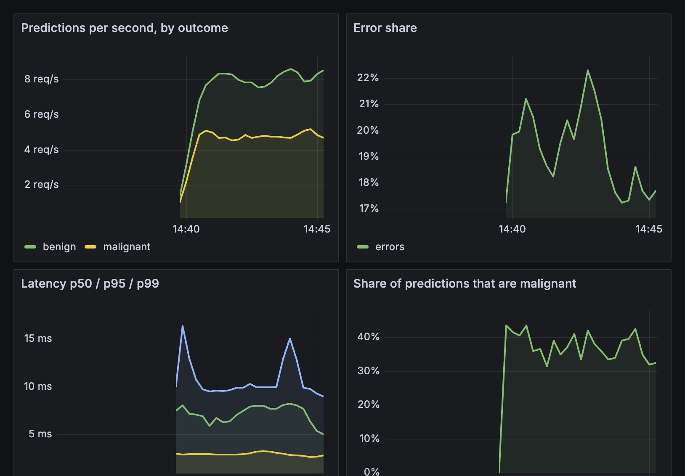
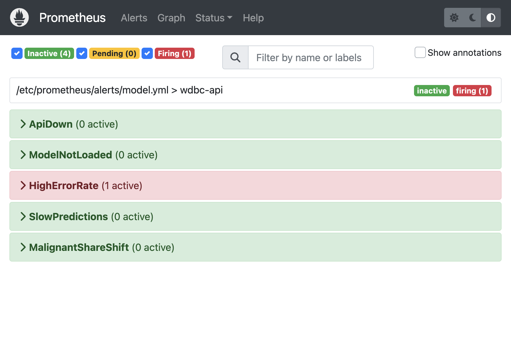
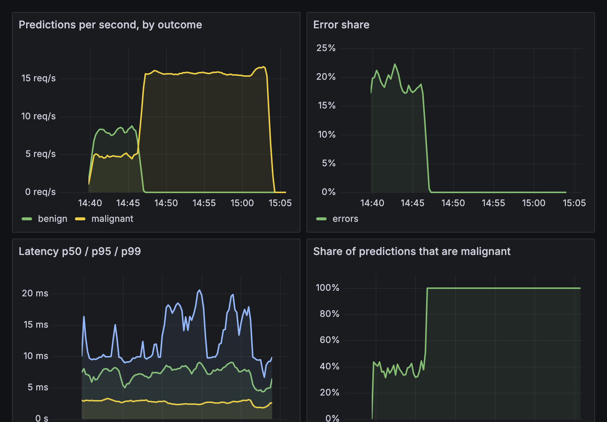
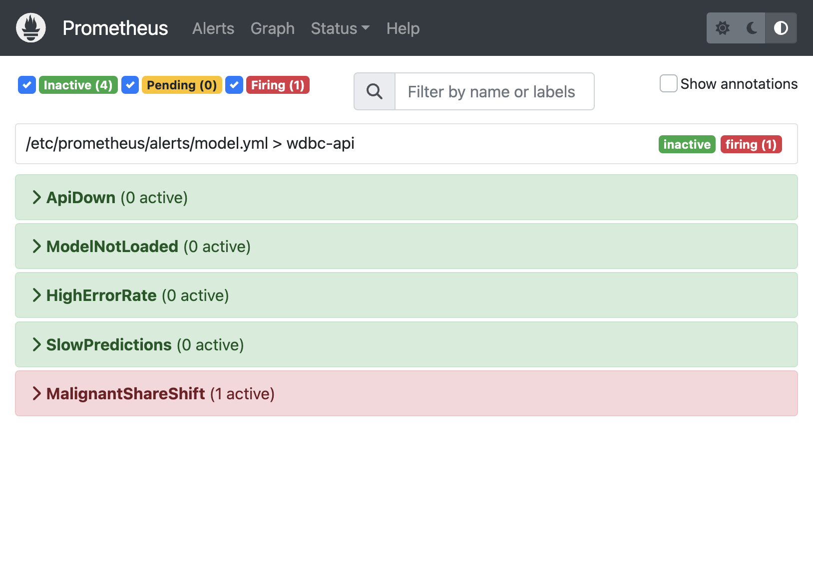
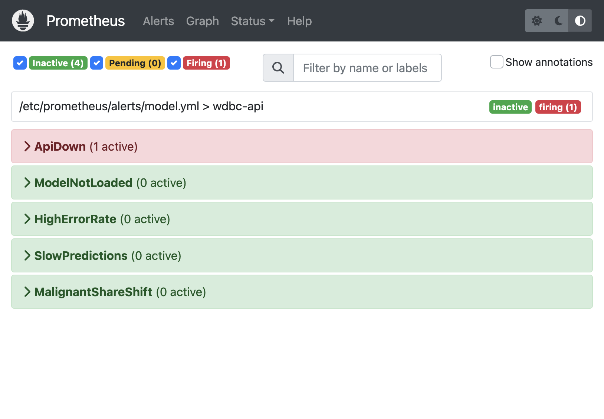

# Tutorial 04 (thư mục tutorial06) — Câu trả lời tiếng Việt (Prometheus & Grafana)

**Môi trường verify:** macOS arm64 · Python 3.12.4 (local) / 3.11-slim (Docker) · scikit-learn 1.6.0 · prometheus-client 0.21.1 · Prometheus v2.51.2 · Grafana 10.4.2 · path `tutorial06/ddm501-t04-monitoring/`

**Verify theo README (đã chạy thật, 27/09/2026):**

```text
train_model.py:        452 rows train, test ROC AUC 0.99738, models/model_card.json version 1.0.0
count_series (thường): 23 time series, /metrics payload 3,240 bytes
count_series (TRAP=1): 643 time series, /metrics payload 51,795 bytes   (~28x series, ~16x bytes)
--broken 0.2:          error share ~17-22%  -> HighErrorRate pending 07:39:43, FIRING sau đúng 5m
--drift 3.0:           malignant share 0.36 -> 1.00, error 0%, p95 ~7 ms (không đổi)
                       -> MalignantShareShift pending 07:46:18, FIRING 08:01:18 (đúng 15m)
docker compose stop api: up 1 -> 0 lúc 08:06:26, ApiDown pending 08:06:28, FIRING 08:07:28
promtool check rules:  SUCCESS: 5 rules found
```

Screenshot trong `screenshots/`.

---

## 1. "Nothing to see" — 5 câu hỏi và metric trả lời từng câu

| # | Câu hỏi | Metric | Kiểu | PromQL |
|---|---|---|---|---|
| 1 | Đã phục vụ bao nhiêu prediction? | `wdbc_predictions_total{outcome}` | Counter | `sum(increase(wdbc_predictions_total[3w]))` |
| 2 | Bao nhiêu % request lỗi? | `wdbc_errors_total{reason}` + predictions | Counter | `sum(rate(errors[5m])) / (sum(rate(errors[5m])) + sum(rate(predictions[5m])))` |
| 3 | Chậm hơn thứ Ba tuần trước không? | `wdbc_prediction_latency_seconds_bucket` | Histogram | `histogram_quantile(0.95, ...)` so với `... offset 7d` |
| 4 | Model version nào đang chạy? | `wdbc_model_info{version,sklearn_version}` | Gauge (info) | `wdbc_model_info == 1` |
| 5 | Phân phối câu trả lời còn như lúc deploy? | `wdbc_malignant_share` | Gauge | `wdbc_malignant_share` so với baseline 0.37 |

## 2. Trang `/metrics` (output thật)

Sau `traffic.py --rps 30 --seconds 20 --broken 0.1` (489 requests: 442 ok, 47 lỗi):

```text
wdbc_predictions_total{outcome="benign"} 285.0
wdbc_predictions_total{outcome="malignant"} 157.0
wdbc_errors_total{reason="missing_features"} 47.0
wdbc_prediction_latency_seconds_bucket{le="0.001"} 72.0
wdbc_prediction_latency_seconds_bucket{le="0.0025"} 437.0
wdbc_prediction_latency_seconds_bucket{le="0.005"} 441.0
wdbc_prediction_latency_seconds_bucket{le="0.01"} 442.0
wdbc_prediction_latency_seconds_count 442.0
wdbc_prediction_latency_seconds_sum 0.6558559260004131
wdbc_model_loaded 1.0
wdbc_model_info{sklearn_version="1.6.0",version="1.0.0"} 1.0
wdbc_malignant_share 0.38
```

Service không gửi gì cho ai; Prometheus tự đến lấy (pull) mỗi 5s. Vì vậy service chết thể hiện bằng sự **vắng mặt** của scrape → `up == 0`.

## 3. Ba kiểu metric — đọc histogram thật

- 442 request: 72 xong trong ≤1 ms, 437 trong ≤2.5 ms, 441 trong ≤5 ms, tất cả ≤10 ms.
- Trung bình = 0.6559 / 442 = **1.48 ms**. Con số này không cho biết 1 request chậm gấp ~4 lần phần còn lại; bucket thì cho biết.
- p95 nằm giữa 1 ms và 2.5 ms; `histogram_quantile` nội suy tuyến tính trong khoảng đó → bucket phải bao quanh vùng giá trị quan tâm (ở đây dừng ở 1s thay vì default 10s).

## 4. Các alert (file `monitoring/prometheus/alerts/model.yml`)

5 rule được Prometheus load (Status → Rules), tất cả đều có `for:`:

| Alert | Điều kiện | for | Vì sao tách riêng |
|---|---|---|---|
| ApiDown | `up{job="wdbc-api"} == 0` | 1m | Scrape vắng mặt; service chết không tự báo được |
| ModelNotLoaded | `wdbc_model_loaded == 0` | 2m | Port vẫn trả lời nhưng mọi prediction 503 |
| HighErrorRate | error share > 5% | 5m | Tỉ lệ, không phải số đếm |
| SlowPredictions | p95 > 50 ms | 10m | Đuôi phân phối, không phải trung bình |
| MalignantShareShift | `abs(share - 0.37) > 0.15` | 15m | Không có gì hỏng — câu trả lời đã đổi; chỉ ML service có |

## 5. Watch it happen (Docker stack, số đo từ Prometheus API)

Prometheus Targets: `wdbc-api` **UP** (`http://api:8000/metrics`) ngay lần xem đầu. Grafana: dashboard `DDM501 / WDBC API — Tutorial 04` được provision sẵn.

| Run | pred/s | Error share | p95 latency | Malignant share | Alert |
|---|---|---|---|---|---|
| `--broken 0.2` (6.5 phút, 6,227 req, 1,190 lỗi) | ~13 | **17–22%** | 5–7 ms | 0.35–0.36 | HighErrorRate pending 07:39:43 → **firing** 07:44:43 |
| `--drift 3.0` (17 phút) | ~15.6 (100% malignant, 0 benign) | **0%** | p50 ~2.5 ms, p95 ~7–8 ms | **1.00** | MalignantShareShift pending 07:46:18 → **firing** 08:01:18 |
| `docker compose stop api` (08:06:26) | **0** | – | – | – (series biến mất) | `up` = 0 → ApiDown pending 08:06:28 → **firing** 08:07:28 |

Quan sát thêm:

- Sau khi dừng `--broken`, HighErrorRate **tự resolve** trong ~5 phút (cửa sổ `rate(...[5m])` cần thời gian để "quên" lỗi cũ). Alert có độ trễ cả lúc bật lẫn lúc tắt.
- Hàng giữa (drift) là hàng đáng suy nghĩ: error rate, container health đều **xanh**, latency vẫn cách ngưỡng 50 ms rất xa (p99 dao động lên ~20 ms là nhiễu của laptop, p50 phẳng ~2.5 ms) — vì service thực sự khỏe. Input đã lệch 3σ, model trả "malignant" cho **100%** request, và thứ duy nhất nhận ra là `wdbc_malignant_share`.
- Khi `docker compose stop api`, `MalignantShareShift` đang firing lập tức chuyển **inactive**: metric biến mất cùng process, nên mọi alert dựa trên metric của service đều "im lặng" khi service chết. Chỉ `up == 0` (do chính Prometheus sinh ra) còn báo được — đó là lý do ApiDown là alert đầu tiên ai cũng viết.
- Gauge giữ giá trị cuối: sau khi traffic drift dừng (15:03 trên dashboard), `wdbc_malignant_share` vẫn đứng ở 100% vì không có prediction mới để cập nhật cửa sổ 200 mẫu.
- **Bẫy cold-start:** vừa restart container, chưa có traffic, `MalignantShareShift` đã **pending** (tái hiện 2 lần) vì gauge khởi tạo = 0.0, lệch 37 điểm so với baseline. Nếu API idle > 15 phút sau restart, alert sẽ báo giả. Cách sửa: chỉ đánh giá khi có traffic, ví dụ thêm `and on() sum(rate(wdbc_predictions_total[15m])) > 0` vào `expr`.
- **Đã sửa annotation của `MalignantShareShift`:** bản gốc ghi "Now 63% against a baseline of 37%" trong khi share thật là 100%, vì `$value` là kết quả của `expr` = `abs(share − 0.37)` = độ lệch, không phải share. Description giờ là "63% away from a baseline of 37%". `promtool check rules` pass, đã reload Prometheus.

**Screenshots**







## 6. Label cardinality

| | Label hợp lý | Thêm `sample_id` (`T04_TRAP=1`) |
|---|---|---|
| Time series `wdbc_*` | **23** | **643** |
| `wdbc_predictions_total` | 2 | 312 |
| `/metrics` payload | 3,240 bytes | 51,795 bytes |
| Tăng trưởng | hằng số | +1 series cho mỗi bệnh nhân mới, mãi mãi |

(PDF ghi 639; số chính xác phụ thuộc bao nhiêu `sample_id` khác nhau được random chọn trong 20 giây.) Đã tắt lại `T04_TRAP=0` và restart trước khi làm tiếp.

---

## Checklist

**1. Vì sao Counter gần như không bao giờ đọc trực tiếp, và bọc nó trong gì?**
Counter chỉ tăng từ lúc process khởi động, và **reset về 0 khi restart**. "3,412 predictions" không cho biết đang nhanh hay chậm, và bị nhảy khi deploy. Ta bọc trong `rate()` (tốc độ/giây trung bình trên cửa sổ) hoặc `increase()` (số tăng trong cửa sổ); cả hai tự xử lý counter reset. Ví dụ: `sum by (outcome) (rate(wdbc_predictions_total[1m]))`.

**2. Latency trung bình 40 ms — hai tình huống rất khác nhau cùng ra con số đó? Kiểu metric nào phân biệt?**
- (a) Mọi request đều mất ~40 ms — ổn định, không ai khổ.
- (b) ~95% request mất ~10 ms, ~5% mất ~600 ms (0.95·10 + 0.05·600 ≈ 40) — một nhóm user đang chờ hơn nửa giây: **đây là incident**.

**Histogram** phân biệt được: nó giữ số request theo từng bucket, nên `histogram_quantile(0.95/0.99, ...)` cho p95/p99 ≈ 40 ms ở (a) nhưng ≈ 600 ms ở (b). Counter/Gauge trung bình thì không.

**3. `wdbc_model_info` là gauge luôn = 1. Dùng để làm gì?**
Đây là **info pattern**: giá trị không quan trọng, **label** (`version`, `sklearn_version`) mới là payload. Nó trả lời câu hỏi 4 — "lúc 14:20 version nào đang serve?" — bằng một đường trên graph thay vì đoán. Có thể join với metric khác (`* on() group_left(version) wdbc_model_info`) để gắn version vào error rate/latency, và thấy rõ thời điểm deploy khi label đổi. Rẻ: chỉ 1 series cho mỗi version.

**4. Mọi alert đều có `for:`. Bỏ đi thì hỏng gì?**
Alert sẽ fire ngay khi **một lần evaluate** (5s) vượt ngưỡng. Một spike ngắn (một batch request lỗi, một lần GC làm p95 nhảy, một lần scrape timeout làm `up=0`, hay gauge `malignant_share` dao động với cửa sổ 200 mẫu) sẽ **page người trực lúc 3 giờ sáng** rồi tự hết — flapping, false page, và dần dần mọi người lờ alert đi (alert fatigue). `for:` bắt điều kiện phải đúng liên tục suốt cửa sổ. Trong lần chạy thật, HighErrorRate ở trạng thái *pending* đúng 5 phút rồi mới *firing*.

**5. Bẫy ở exercise 5 biến 23 series thành 639 (của tôi: 643). Label là gì, vì sao số series là không bị chặn chứ không chỉ "lớn"?**
Label là **`sample_id`** (id bệnh nhân) trên `wdbc_predictions_total`. Mỗi tổ hợp tên metric + giá trị label là một time series riêng. `outcome` chỉ có 2 giá trị biết trước → 2 series dù có 1 triệu request. `sample_id` do **client gửi lên**, mỗi bệnh nhân mới là một giá trị mới → +1 series mãi mãi (series cũ không bao giờ bị thu hồi khi process còn sống, và nằm trong TSDB suốt retention). Không có giới hạn trên ngoài số bệnh nhân — tức là tăng theo traffic, cho đến khi Prometheus hết RAM. Quy tắc: label chỉ được lấy giá trị từ một tập **nhỏ, hữu hạn, biết trước** (outcome, status code, model version, region); không bao giờ là id, email, URL có tham số, timestamp hay bất cứ thứ gì user nhập.

**6. Trong lần chạy `--drift 3.0`, panel nào di chuyển, panel nào không? Đó là loại failure gì, alert web-service thông thường có bắt được không?**
- **Không đổi:** *Error share* (0%), *Latency p50/p95/p99* (p50 ~2.5 ms, p95 ~7–8 ms, xa ngưỡng 50 ms), tổng *Predictions per second* (~15.6/s). Riêng trong panel này, đường benign rơi về 0 và malignant chiếm toàn bộ — đó cũng là tín hiệu drift nếu có người nhìn theo outcome.
- **Di chuyển mạnh:** *Share of predictions that are malignant*: 0.36 → **1.00**.

Đây là **data drift / silent model failure**: về mặt kỹ thuật service hoàn toàn khỏe, nhưng input đã lệch khỏi phân phối lúc train nên câu trả lời của model không còn đáng tin — mọi bệnh nhân đều bị chẩn là malignant. Alert web-service thông thường (ApiDown, HighErrorRate, SlowPredictions, health check) **không bắt được** — trong lần chạy thật cả ba đều inactive. Chỉ `MalignantShareShift`, một metric được thêm có chủ đích vì đây là ML service, mới fire (sau 15 phút).
